# Voice Agent Demo

| Owner                 | Name              | Email                              |
| ----------------------|-------------------|------------------------------------|
| Use Case Owner        | Tanguy Pomas      | tanguy.pomas@hpe.com               |
| PCAI Deployment Owner | Tanguy Pomas      | tanguy.pomas@hpe.com               |

## Abstract

This demo aims to show a reactive conversational agent that can transcribe voice input from any language handled by Whisper, process it with a chat LLM (defaulting to Qwen3-30B-A3B-Instruct-2507-FP8) and provide an audio output in any language supported by XTTS-v2 (17 languages). 
One of the strong points of this demo is its **speed and fluidity**: it should take at most a couple of seconds before getting an answer back from the agent, and its answers can be interrupted with the user's voice, allowing for natural conversations.

To showcase the agent interacting with data on the platform, this demo includes the option to connect to a postgres database, create tables that include fake customer information related to mobile/internet subscription and have a discussion leveraging that data, the demo user impersonating one of the fake customers.

This demo features:
* **HPE Machine Learning Inference Software (MLIS)** to deploy the following models:
  - **whisper-large-v3** as STT model, either as a [NIM](https://build.nvidia.com/openai/whisper-large-v3) or using [vLLM](https://huggingface.co/openai/whisper-large-v3-turbo)
  - [**Qwen/Qwen3-30B-A3B-Instruct-2507-FP8**](https://huggingface.co/Qwen/Qwen3-30B-A3B-Instruct-2507-FP8) as chat model (text-to-text)
  - [**XTTS-v2**](https://huggingface.co/coqui/XTTS-v2) as TTS model
* A custom Gradio application to interact with those models
* **Natural, reactive conversations** with the chat model, with possibility to interrupt its answers
* **Multilingual support** from both Whisper STT and XTTS-v2 TTS models
* Additional **voice creation/voice cloning** for XTTS-v2 TTS model
* Language selection for Whisper transcriptions, as well as voice selection for XTTS-v2 generated speech within the Gradio interface

Optional features, if connection to DB enabled from the Gradio UI:
* **Agent to leverage data from a Postgres DB**, containing fake customer information: impersonate a customer making requests to the agent that has information regarding you, your subscription plan, tickets, analyzing your sentiment...
* **Data visualization**: either from the Gradio app, from PCAI data catalog, or even **build your own superset dashboard**

Supported languages:
* English (en)
* Spanish (es)
* French (fr)
* German (de)
* Italian (it)
* Portuguese (pt)
* Polish (pl)
* Turkish (tr)
* Russian (ru)
* Dutch (nl)
* Czech (cs)
* Arabic (ar)
* Chinese (zh-cn)
* Japanese (ja)
* Hungarian (hu)
* Korean (ko)
* Hindi (hi)

**Note**

That list corresponds to languages supported by XTTS-v2, Whisper can transcribe additional languages and the Qwen3 chat model can be swapped for another one if its performance for the chosen language is underwhelming.

In other words, you can expect to talk with the agent using languages that are not on this list, but the agent's responses will necessarily be in one of those languages.

Also note that **only English has been tested for dicussion with database connection enabled**, some hiccups are to be expected with any of the other 17 languages supported by XTTS.

**Recordings**:
* [**Demo Video**](https://storage.googleapis.com/ai-solution-engineering-videos/public/Voice_Agent.mp4)

## Description

### Overview

The demo relies on Whisper to transcribe the demo user queries into text, a standard chat model (Qwen3-30B-A3B-Instruct-2507-FP8) for interpreting the queries and respond to them, and XTTS-v2 to generate an oral response from the text output. Those three models need to be deployed to MLIS, and the demo user is expected to connect them to the Gradio application to interact with them.

Input language (expected by Whisper for its transcription), as well as output language (chat model response's language, to generate audio from by XTTS) can be selected from the application UI.

Voice to be used for generating the audio response can also be selected from the UI: XTTS provide dozens of different voices by default, some are being more adapted to certain languages. XTTS-v2 supports voice cloning, and this demo allows for that: you can upload a clean voice sample to the application, and the cloned voice will be available for selection for future conversations with the agent.

Additional demo part involves connecting to a postgres database, creating a few tables, mimicking data that could correspond to customers for a mobile/internet provider. If connection to the database is enabled, standard chatbot discussion is disabled: all the conversation will be centered on that customer data, and the demo user is expected to impersonate a customer from the database.

#### Architecture Diagram

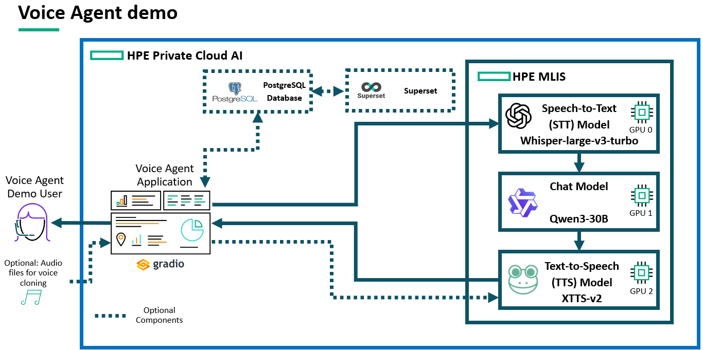

### Workflow

#### Basic Demo Workflow

The actual demo workflow is quite simple, open the Gradio app, go the voice input and voice output tabs to:
* Have Whisper transcribe your questions in the language you plan to speak (in the Voice Input tab)
* Get answers from the language you want to hear as output (most likely identical to input language, but not necessarily) and select the voice you want the answer to be generated with (in the Voice Output tab)

Once done, go back to the Voice Chat tab, click on Conversation Mode, then on Start once you are ready to talk and on Stop when you no longer want the agent to listen and respond to you.
Saying anything while a response is getting played will interrupt the response and will make the agent generate another response to the latest thing you said. This will happen only when saying things loud enough and for long enough, so that parasite noises won't interrupt the agent otherwise.
The sound threshold above which the agent will actively listen and then respond to can be tuned with the Trigger Sensitivity bar. Lowering it will make your voice more easily detected in calm environments where you don't need to speak loudly, increasing it is better for noisy environments where you need to talk loudly and ignore significant background noise.

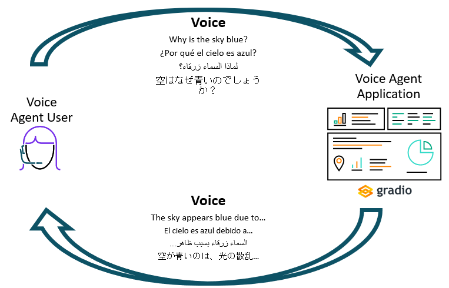

#### Demo Workflow with optional SQL Data

**Note: this part has not been tested with non-English languages**

If you are opting for the optional "agent with access to customer Database"/"DB connected mode" component of this demo, a few things change:
* Tick the box for enabling database connection
* Initialize tables if not done during the demo setup, or if tables where deleted
* Optionally, monitor the data from the database from:
	* AIE Data Catalog
	* Superset, after adding the created tables as new data sources

It is otherwise identical to chatting without access to SQL data.

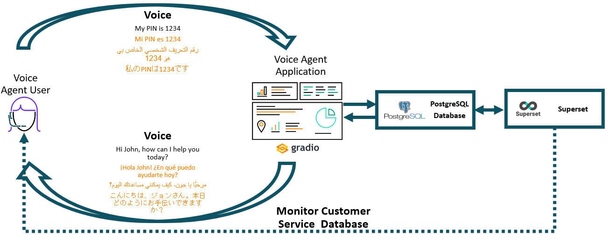

## Deployment

### Prerequisites

* **Three GPUs** to deploy the three models. For reference, all models chosen for this demo can fit on **L40S GPUs**.
* (Optional) Access to a postgres database (to enable the database connected part of the demo). We recommend that you deploy it on the same PCAI instance using a [helm chart from our frameworks repo](https://github.com/ai-solution-eng/frameworks/tree/main/postgresql) 

### Installation and configuration

**1. Import the Gradio application**:
* Use the helm chart made available in the [chart folder](../deploy/chart) of this repo. No change in the values is needed.

**2. Deploy the three models using MLIS**:
  
  * **Qwen/Qwen3-30B-A3B-Instruct-2507-FP8** MLIS configuration:
    * Registry: None
	* Image: vllm/vllm-openai:latest
	* Resources:
	  * CPU: 4 to 6 (flexible, lower values may work)
	  * Memory: 40Gi to 60Gi (flexible, lower values may work)
	  * GPU: 1 to 1 (mandatory)
	* Arguments: --model Qwen/Qwen3-30B-A3B-Instruct-2507-FP8 --enable-auto-tool-choice --tool-call-parser hermes --port 8080 --max-model-len 32768	
	* Environment variables (optional):
	  * AIOLI_DISABLE_LOGGER to 1
     
  * **openai/whisper-large-v3-turbo** MLIS configuration:
    * Registry: None
	* Image: tpomas/vllm-audio:0.15.1
	* Resources:
	  * CPU: 1 to 1 (flexible)
	  * Memory: 10Gi to 10Gi (flexible)
	  * GPU: 1 to 1 (mandatory)
	* Arguments: --model openai/whisper-large-v3-turbo --port 8080
     
  * **XTTS-v2 model** MLIS configuration:
    * Registry: None
	* Image: tpomas/xtts-server:5.2.0
	* Resources:
	  * CPU: 4 to 16 (flexible, lower values may work)
	  * Memory: 16Gi to 32Gi (flexible, lower values may work)
	  * GPU: 1 to 1 (mandatory)
	* No additional argument needed
	* Environment variables:
	  * AIOLI_SERVICE_PORT to 8000 (mandatory)

To use those models, an API token will have to be generated for each of those three deployments. You can do this from the Gen AI -> Model Endpoints page of AIE:
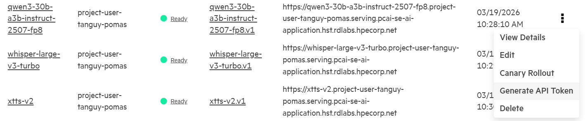

**3. Connect models to Gradio application**:
  * After importing the Gradio application, go to Tools & Frameworks, and click on "Open" to reach the Gradio application
  * Once there, to connect the application with the **chat model**, and click on the  **Agents Settings** tab:
    * Fill the **API Base URL** with the endpoint of the chat model you deployed with MLIS
    * Fill the **API key** field with the API token that you have generated after deploying the chat model with MLIS
    * Fill the **Model Name** field with the id of the model you deployed: Qwen/Qwen3-30B-A3B-Instruct-2507-FP8 if you decided to deploy that model. Depending on which model you deployed, the corresponding model id may slightly differ from the way it's displayed on HuggingFace, so be mindful of that (a GET request on the /v1/models endpoint will give you the exact model id).
    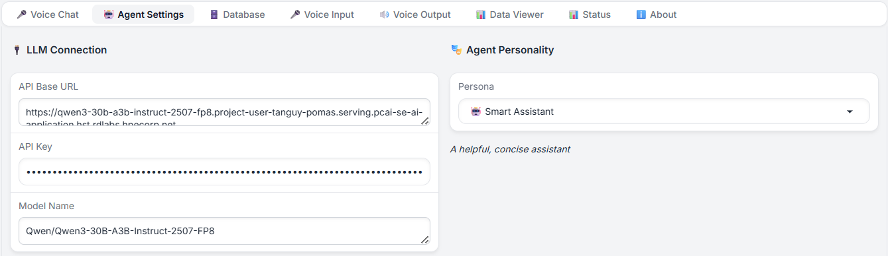
  * Adding connection to Whisper and XTTS-v2:
    * Repeat the same process for Whisper by clicking on the **Voice Input** tab and filling the **ASR Server** and **ASR API Key** fields (model name not needed).
    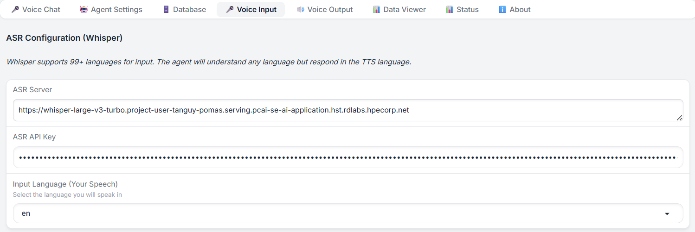
	* And again for XTTS, by clicking on the **Voice Output** tab and filling the **TTS Server** and **TTS API Key** fields (model name not needed).
    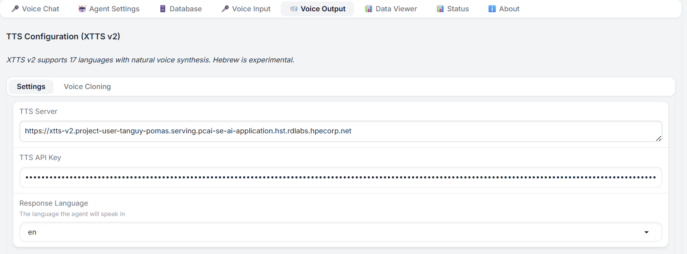
  * The **Status** tab should give you a precise state of the connection to all three models
    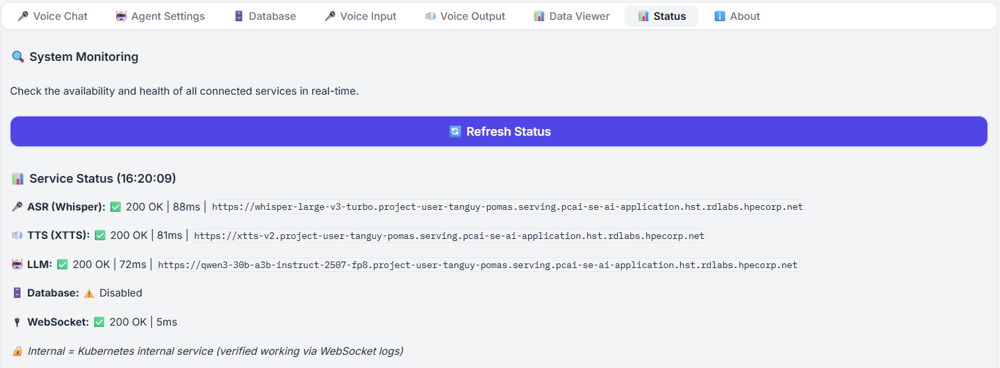

**4. (Optional) Enable connection with Postgres Database**
  * The next steps are only needed if you plan to show database interaction during your demo
  * Deploy Postgres using a [helm chart from our frameworks repo](https://github.com/ai-solution-eng/frameworks/tree/main/postgresql), no need to change any values
  * On the Gradio app, click on **Database**:
    * **Database Host** should be set to the **cluster IP of your postgresql service**
    * **Database Port** should be set to **5432**
    * **Database Name** should be to **customer_service**
    * **Database User** should be set to **postgres**
    * **Database Password** should be to **postgres**
    * **Admin User** should be set to **postgres**
    * **Admin Password** should be to **postgres**
    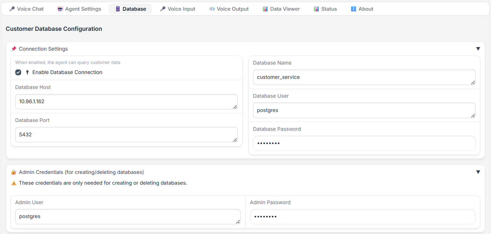
  * Once done, scroll down to Database Management, click on **Create Database** and then, **Initialize Tables**: this will create a new database with tables containing the required mock data to run that part of the demo
	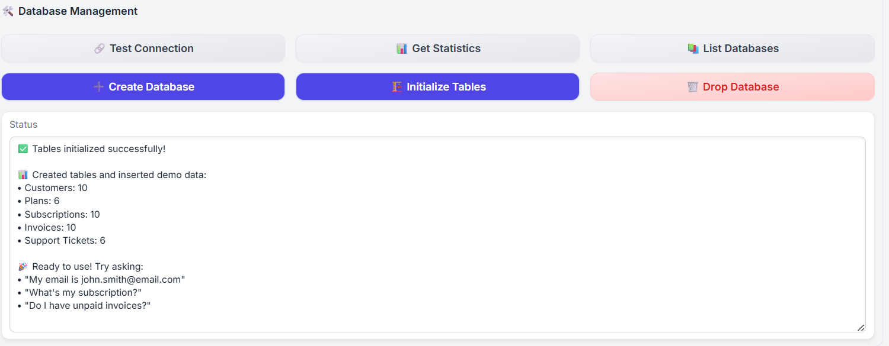
  * The **Data Viewer** tab will allow you to visualize data from the different tables
    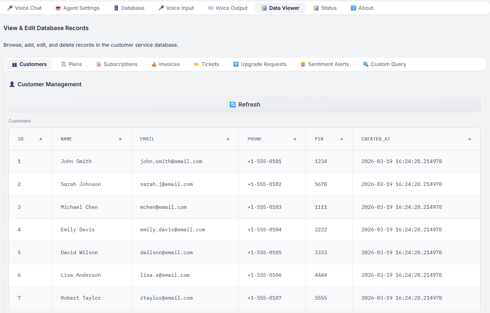

**5. Run the demo**  

	  
**Notes**:
  1. [Qwen/Qwen3-30B-A3B-Instruct-2507-FP8](https://huggingface.co/Qwen/Qwen3-30B-A3B-Instruct-2507-FP8) is just a suggestion that proved to work well for most, if not all languages supported by XTTS, but any OpenAI API compatible chat model could be used instead, as long as they supports the languages you plan to use the demo with.
  2. To deploy openai/whisper-large-v3-turbo with vLLM, a custom image is needed, as [STT transcription API is not available in the official vLLM images](https://docs.vllm.ai/en/latest/serving/openai_compatible_server/#transcriptions-api). "tpomas/vllm-audio:0.15.1" has been created from vllm/vllm-openai:v0.15.1 with the addition of running pip install vllm[audio]. It is provided for convenience, but you can build and use your own image instead.
  3. Alternatively, you can also use a **NIM to deploy whisper-large-v3**, if you have set up an NGC registry in MLIS. 	
  4. XTTS-v2 is neither vLLM-compatible, nor provide an Open AI API compatibility by default. The custom "tpomas/xtts-server:5.2.0" image has been built using the code available in the [xtts-server folder](../source/docker/xtts-server) made available in this repo.

## Running the demo

1. **Open the Gradio app**
2. **Select the language for Whisper, and the voice for XTTS**:
    * Click on the Voice Input tab, and select the language you plan to speak with the agent in the Input Language (Your Speech) dropdown 
    * Click on the Voice Output tab, and select the language you want the agent to respond in.
    * **Notes:**
      *  Input and output languages don't necessarily have to match
      *  Optional: Scrolling down in the Voice Output tab, you can select the voice that XTTS will use when generating its response. Some voices are more recommended than other for a specific language, but clicking "All Voices" will allow to list and select any speaker voice from its entire list of voices. 
      *  Optional, **voice cloning:** Still on the Voice Output tab, you can open the Voice Cloning tab that allows you to create additional custom voices for the XTTS, by cloning the voice from a reference audio. Just provide a high-quality audio sample of a voice you wish to use (10s~20s is enough), upload it, give it a name and click on "Upload & Clone Voice". The process shouldn't take more than a couple of seconds, and the cloned voice should be available for selection in the Settings tab, alongside the original voices that XTTS provides. 
4. **Discuss with the chat model**:
    * Go back to the Voice Chat tab, and click on Conversation Mode (more interactive and natural compared to Push-to-Talk option)
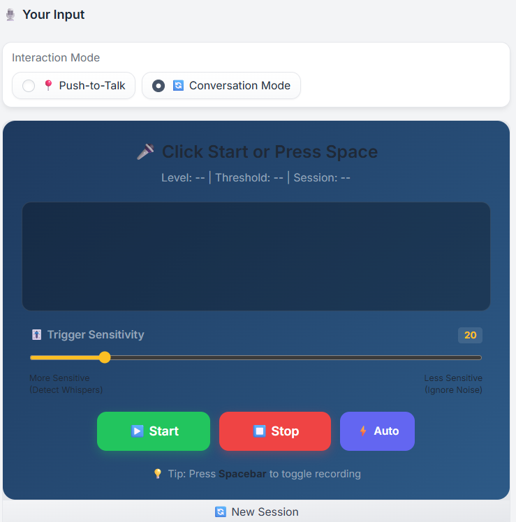
    * Allow the Gradio app to access your mic if prompted
    * Click on Start for the app to start listening to your mic, and ask anything you want to the agent (the chat model):
      * Once you stop talking, Whisper will transcribe your audio input into text, the chat model will process it and generate text as a response, and XTTS will generate the audio response from that text. The whole process shouldn't take more than a couple of seconds, depending on multiple factors (for how long you've been talking, how long of a response the chat model has output that needs audio generation, which models are in use, served with what images...)
      * Once the Agents starts responding to your question, you can:
        * Interrupt its answer by asking something else. In that case, it will start processing and answering to the latest thing you've said.
        * Stop its answer by clicking the stop icon on the agent response progress bar.
      * In case the agent is too sensitive to your background noise and/or you want to stop discussing with it, you can:
        * Increase the sensitivity using the yellow sensitivity bar, which will make the application less sensitive to noise
        * Click on the red Stop button to stop your mic input being monitored
      * Use the New Session button to refresh the whole conversation history
5. **(Optional) Chat with the agent with connection to database enabled**:
    * Note: **This mode has only been tested in English**
    * Go to the Database tab and tick the Enable Database Connection box
    * Go back to the Voice Chat tab, and start a new session:
      * Interacting with the agent isn't any different from before, but the conversation will be railroaded to assume you are a customer from the database (whose data can be viewed beforehand in the Data Viewer tab)
      * You will be asked a 4-digit PIN to authentify (see Customers table in the Data Viewer for existing customers with their PINs - you can also add new customers from there)
      * If successfully identified, you should see your account information on the side: 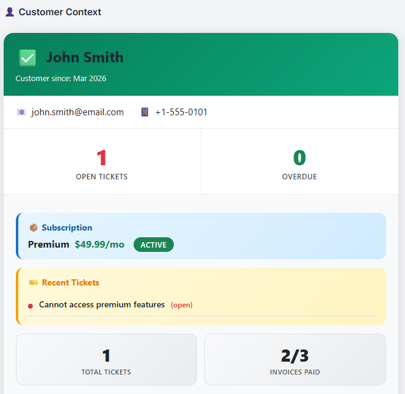
      * Then, you can play around asking different things related to your account, for example:
        * Check your subscription, your invoice, your tickets
        * Complain about something (creating a sentiment alert)
        * Ask to open/close a ticket
        * Ask to change your plan
        * ...
    * If you want to go back to the free-form chat agent, untick the Enable Database Connection box in the Database tab 
7. **(Optional) Visualize Data on Superset**:
    * Open Superset and go to Settings, Database Connections and **create a database connection** of type "PostgreSQL" with the same values you already filled in the application, with the addition of **customer_service** as database name.
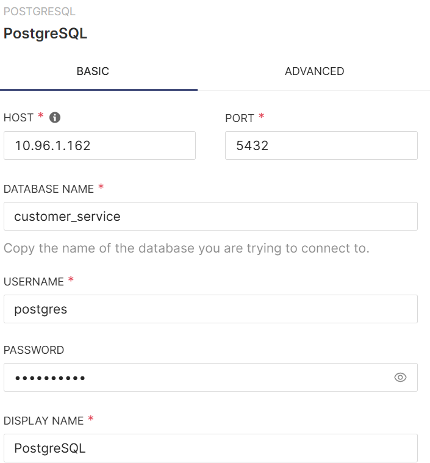
    * **Create a dataset**: Go to Datasets, + Dataset, and select your database, public as schema, and select the table you want to use for building charts. To build multiple charts using data from multiple tables, you will have to create multiple datasets. 
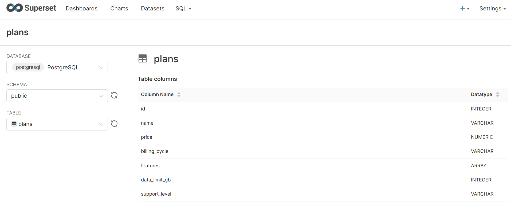
    * Database connection and dataset creation over, Superset charts and dashboard creation is no different than standard Superset usage.
    * Keep in mind that if you plan to build charts displaying data that is not available by in the original tables initialized by the app (such as sentiment alerts, after impersonating a dissatisfied customer for example), **you will erase that newly generated data if you click on the "Initialize Tables" or "Drop Database" buttons in the app**. This may break your charts. 

## Important notes

* Don't hesitate to click on the **New Session** button: everytime you want to start a new conversation, reopen the application, think there has been an issue with the previous conversation, and want to impersonate another customer, if database connection has been enabled.
* XTTS model is downloaded the first time the endpoint is called: this means that **the first time you test the application with a newly deployed XTTS model, the request will timeout**. This is normal: wait a couple of minutes, start a new session and try again, it should work.
* Text pronounced by the XTTS-generated voice should be written in a single language. Expect heavily mispronounced words if that is not the case (e.g. asking the agent how to say X in language Y or having the agent connected to the database, with some info in English, while not setting English output).
* Chat model (Qwen) output is processed to remove some special characters, but not all of them are captured: expect XTTS to generate unusual sounds when trying to pronounce those special characters. If you have access to kubectl, you can view which characters cause this by displaying the logs of the application.
* "Error: Connection timed out" may appear on the app UI after chatting with the agent. This error display is inconsistent and inconsequential: if you hear the agent's voiced response, the application is still running fine.
* All values to fill in the Gradio app are cached into your browser, except for the Database Admin password (used for creating/deleting tables). Refreshing/Closing/Reopening the app on the same browser shouldn't have an impact on its connection to the different models, but **opening the app in incognito mode, or in another browser will force you to fill in all the required values again**.
* While only English has been tested with the Database-connected agent conversation, it may work with all languages supported by XTTS, but probably not as good as in English. Test it in advance if this is something you plan to demo, but be prepared to stick with the non-database-connected part of this demo if performance with your language is underwhelming.
* **Test the application before delivering a demo**: the application is complex, and not everything has been thoroughly tested.

## Comments on Performance and Latency

* Significant performance discrepancies have been noted on the Whisper deployment:
  * Using the Whisper-v3-large NIM proved to be running slow using H200 GPUs (~5s for audio transcription), but fast on L40S
  * Earlier versions of vLLM would lead to wrong Whisper output on L40S, but the issue has been solved with v0.15.1   
* These observations are partial, and not the result of rigorous benchmarking. If you notice any performance issue with Whisper, test another deployment method: vLLM if previously using NIM, NIM or a different vLLM version if already using vLLM.
* The chat model should be significantly faster than both Whisper and XTTS, and as such, shouldn't be a source of high latency
* The XTTS deployment used by the app is entirely custom, and no easy-to-plug alternative is provided for this demo. That being said, the application helm chart does allow for built-in XTTS server deployment: enabling it from the values (setting xttsTts.enabled to true) may slightly improve the overall latency of the app (set "localhost:8000" as TTS Server with no API token on the app in that case), at the cost of the application blocking one GPU while deployed on the instance.

## Acknowledgement

This demo has been initially developed by Liav Nachmani.
