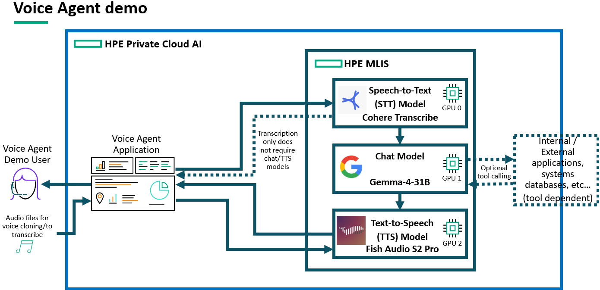
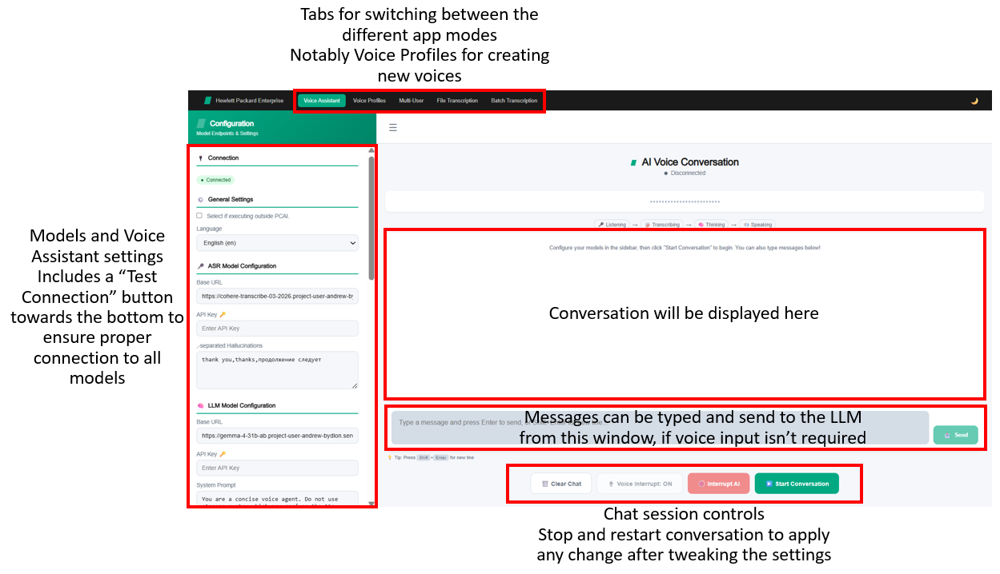

# Conversation Toolbox / Voice Agent Demo

| Owner                 | Name              | Email                              |
| ----------------------|-------------------|------------------------------------|
| Use Case Owner        | Andrew Bydlon     | andrew.bydlon@hpe.com              |
| PCAI Deployment Owner | Andrew Bydlon     | andrew.bydlon@hpe.com              |


## Abstract


A speech‑to‑speech conversational AI and transcription platform built for PCAI. It provides a streaming, voice‑driven assistant with tool calling, real‑time multi‑user transcription rooms, single‑file and batched audio transcription (with optional ML speaker diarization), and Fish S2‑pro voice‑profile cloning.

The backend is a single FastAPI service (`app.py`) backed by Redis and arq workers. All model inference (ASR, LLM, TTS) talks to external vLLM endpoints (expected to correspond to MLIS deployments) shown in the app as configurable base URLs — swap endpoints without rebuilding.

This demo features:
* **HPE Machine Learning Inference Software (MLIS)** to deploy the following models:
  - [**CohereLabs/cohere-transcribe-03-2026**](CohereLabs/cohere-transcribe-03-2026), as STT model, deployed using an image based on [vLLM](https://github.com/vllm-project/vllm)
  - [**RedHatAI/gemma-4-31B-it-FP8-block**](https://huggingface.co/RedHatAI/gemma-4-31B-it-FP8-block) as chat model (text-to-text)
  - [**fishaudio/s2-pro**](https://huggingface.co/fishaudio/s2-pro) as TTS model, deployed using an image based on [vLLM-Omni](https://github.com/vllm-project/vllm-omni)
  - **Note: Both STT and especially chat models can be swapped for other models. For example, the cohere model can be swapped with whisper-large-v3, and the Gemma model be swapped with a Qwen, or a GPT-OSS model. The chat model must have tool calling capabilities.**
    - Replacing fishaudio/s2-pro is not recommended, as the chosen TTS model must support voice cloning to fully benefit from this application features.
* A **custom web application** to interact with those models, that includes:
  * A **Conversational Voice Assistant**:
    * **Natural, reactive conversations** with the chat model, with possibility to **interrupt its answers** and control output voice emotion through tags, such as [laughing], [emphasis], [sad], [sigh], [shouting]...
    * **Tool calling** via a configurable "Response‑API JSON" of MCP‑style tools passed
      into the UI
    * **Multilingual support** from both Cohere Transcribe and Fish Audio S2 Pro models
    * On‑the‑fly reconfiguration: STT language, TTS voice / endpoint, system prompt, ASR & LLM endpoints, hallucination filters — no restart required.
  * **Voice profiles** for the voice assistant:
    * Creating new voice profiles with **voice cloning** for the Fish S2‑pro TTS model (requires voice sample file and its transcription)
  * A **multi‑user live transcription** page:
    * Create a shareable session ID; every connected client speaks and all speech is
  transcribed into a shared live transcript with speaker attribution.
  * A **single‑file transcription** service:
    * Upload one audio file (MP3, WAV, M4A, FLAC, OGG, AAC, …) and get an
      already‑labelled, timestamped transcript written to `TRANSCRIPTS_DIR`.
    * Language selection
    * Optional pyannote diarization
  * A **batch transcription** service:
    * Upload many files at once


### Supported languages

Assuming, like with our previous voice agents demos, that the bottleneck for natural voice assistant in any language is the Text to Speech model, then this demo theoretically supports [all languages supported by Fish S2‑pro](https://huggingface.co/fishaudio/s2-pro#supported-languages):

**Tier 1**: Japanese (ja), English (en), Chinese (zh)

**Tier 2**: Korean (ko), Spanish (es), Portuguese (pt), Arabic (ar), Russian (ru), French (fr), German (de)

**Other supported languages**: sv, it, tr, no, nl, cy, eu, ca, da, gl, ta, hu, fi, pl, et, hi, la, ur, th, vi, jw, bn, yo, xsl, cs, sw, nn, he, ms, uk, id, kk, bg, lv, my, tl, sk, ne, fa, af, el, bo, hr, ro, sn, mi, yi, am, be, km, is, az, sd, br, sq, ps, mn, ht, ml, sr, sa, te, ka, bs, pa, lt, kn, si, hy, mr, as, gu, fo, and more.

In practice, you should **always create a new voice profile** using a sample spoken in the language you plan to use the application with, **unless you plan to use a "Tier 1" supported language**.

**Note: Despite 80+ languages being officially supported by Fish Audio S2‑pro, the voice quality may left to be desired for some languages, even with quality voice samples provided for voice cloning. For those cases, you may still want to try our [previous voice agent demo](../archived-demos/voice-agent-xtts/doc)**


**Recordings**:
* [**Demo Video**](https://storage.googleapis.com/ai-solution-engineering-videos/public/ConversationToolboxDemo.mkv)


## Description

### Overview

The main use of this demo is the conversational voice assistant that relies on Cohere to transcribe the demo user queries into text, on a standard chat model (gemma-4-31B-it-FP8-block) for interpreting the queries and respond to them, and on Fish Audio S2 Pro to generate an oral response from the text output. Those three models need to be deployed to MLIS, and the demo user is expected to connect them to the application, by providing their URLs and API keys, either during the application deployment (changing values.yaml) or after, directly from the UI.

Input language (expected by Cohere for its transcription) can be selected from the application UI. Output language will match whatever language the chat model responds in, which can be changed, as its system prompt is made visible and editable from the UI.

Voice to be used for generating the audio response can also be selected from the UI. Fish Audio S2 Pro supports voice cloning, and this demo allows for that: you can upload a clean voice sample (30s max) to the application (and its transcription), and the cloned voice will be available for selection for future conversations with the agent. This is actually heavily recommended for non-english demos. For convenience, if you do not have a voice sample and its transcription at hand, you can also record yourself from the application to clone your voice, and an auto-transcribe button (leveraging Cohere) is available to avoid having to type what you said/is said in your provided sample.

The web app this demo leverages also includes a multi-user live transcription service, as well as file and batch transcription services, that mostly rely on Cohere to work. For those two services, speaker diarization can be enabled but requires an additional GPU at importing time, which is not recommended. 

#### Architecture Diagram



### Workflow

#### Basic Demo Workflow

The actual demo workflow is quite simple, open the app, go the Voice Assistant tab and check the settings first:
* **Language**, under **General Settings** refers to the language your speech will be transcribed as by Cohere.
* Review the **System Prompt** under the **LLM Model Configuration** section. This is especially important if you want the model to respond to you in a language different from the one you speak or if you want to leverage Fish Audio S2‑pro tags (the LLM must output them in order for the TTS model to use them).
  * Note that these tags may not be as impactful for all languages: you may want to remove them from the system prompt, depending on your language.
* Chose the **TTS Voice**, under the **TTS Model Configuration** section. A **voice cloned from a sample in the language you expect as output is highly recommended**.
* If the demo was set up properly, no change should be required in either of Base URL or API Key from the ASR, LLM or TTS Model Configuration Sections. The **Test Connection** button, in the Local Storage section can be pressed to check all models are reachable.
* (Optional) Add tools you want the LLM to leverage in the **Tool Calling Response-API Json** field. See the "Provide tools to the LLM" section for details.

Once done, you can start chatting with the Voice Assistant:
* Click on **Start Conversation**
* Either start talking, or write down your questions, and the LLM will generate a response, using your provided system prompt. Shortly after, the audio will automatically play.
* Click **Stop Conversation** when you are done
* During the conversation, click on the **Interrupt AI** to end the audio answer that is being played (e.g. the answer is too long, or not interesting). If "Voice Interrupt" is set to ON, you can also interrupt the audio answer whenever you say something, which is then passed to the LLM to generate a new response.
* Don't hesitate to adjust the **Noise Floor** setting, under the Audio Settings section: reduce its value if you feel that you have to speak too loud for your speech to be processed. On the opposite, increase it if you feel the application is too noise sensitve and tends to interpret background noise as something to transcribe.
* To apply changes, you have to stop and restart the conversation.

The other features of this application (multi-user live transcription, file/batch transcription) are not the focus of this demo, but should work out-of-the-box, as long as Cohere/the STT model is connected.

### Application Interface



## Deployment

### Prerequisites

* **Three GPUs** to deploy the three models. While both Cohere transcribe and Fish Audio S2 pro both easily fit on even the smallest of GPUs PCAI has to offer (L40S), that may not be the case for gemma-4-31B-it-FP8-block. If Gemma 4 cannot fit onto one of your platform GPU, any other OpenAI API-compatible LLM supporting tool calling can be deployed and used instead.
* (Optional) A forth GPU to enable diarization, only if interested in File/Batch transcriptions
* (Optional) Whatever is required to have tools working as intended. See the "Provide tools to the LLM" section for details. Exact requirements will depend on the tools/MCP server to be used by the LLM.

### Installation and configuration

**1. Deploy the three models using MLIS**:

 * **RedHatAI/gemma-4-31B-it-FP8-block** MLIS configuration:
    * Registry: None
    * Model Format: Custom
	* Image: vllm/vllm-openai:gemma4
	* Resources:
	  * CPU: 8 to 16 (flexible, lower values may work)
	  * Memory: 60Gi to 100Gi (flexible, lower values may work)
	  * GPU: 1 to 1 (mandatory - note that H200 were used for this demo, but a single H100 should still be enough)
	* Arguments: RedHatAI/gemma-4-31B-it-FP8-block --enable-auto-tool-choice --reasoning-parser gemma4 --tool-call-parser gemma4 --limit-mm-per-prompt {"image":0,"video":0} --async-scheduling --kv-cache-dtype fp8 --kv-cache-dtype-skip-layers sliding_window --port 8080 --chat-template examples/tool_chat_template_gemma4.jinja	
     
  * **CohereLabs/cohere-transcribe-03-2026** MLIS configuration:
    * Registry: None
    * Model Format: Custom
	* Image: ghcr.io/ai-solution-eng/vllm-audio-video:v1.0
	* Resources:
	  * CPU: 4 to 8 (flexible, lower values may work)
	  * Memory: 20Gi to 40Gi (flexible, lower values may work)
	  * GPU: 1 to 1 (mandatory)
	* Arguments: CohereLabs/cohere-transcribe-03-2026 --trust-remote-code --port 8080
     
  * **fishaudio/s2-pro** MLIS configuration:
    * Registry: None
    * Model Format: Custom
	* Image: ghcr.io/ai-solution-eng/vllm-omni-fish:v1.0
	* Resources:
	  * CPU: 4 to 8 (flexible, lower values may work)
	  * Memory: 32Gi to 64Gi (flexible, lower values may work)
	  * GPU: 1 to 1 (mandatory)
	* Arguments: fishaudio/s2-pro --omni --port 8080 

To use those models, an API token will have to be generated for each of the three deployments. You can do this from the Gen AI -> Model Endpoints page of AIE.

**2. Import the application**:
* Use the helm chart (conversation-toolbox-4.4.2.tar.gz) made available in this folder. Recommended values to provide are:
  * `config.asrBaseUrl`: MLIS endpoint corresponding to the ASR/Cohere deployment (without /v1)
  * `config.llmBaseUrl`: MLIS endpoint corresponding to the LLM/Gemma4 deployment (without /v1)
  * `config.ttsBaseUrl`: MLIS endpoint corresponding to the TTS/Fish Audio S2 pro deployment (without /v1)
  * `secrets.asrApiKey`: API token corresponding to the ASR/Cohere deployment
  * `secrets.llmApiKey`: API token corresponding to the LLM/Gemma4 deployment
  * `secrets.ttsApiKey`: API token corresponding to the TTS/Fish Audio S2 pro deployment

* Setting these values when importing the helm chart will make the application default to using these endpoints, but they can be edited from the UI itself, so there is no need to redeploy the application whenever an endpoint/key change.
* No other value change is required to use the voice assistant, but setting `diarization.enabled` to true is required to enable diarization if using the transcription feature of this application.
  * Note that enabling diarization will make the application itself require one GPU. Additionally, diarization is not required for transcription itself, but only needed if distinguishing who is speaking in multi persons discussions is required. For those reasons, it is disabled by default.
  * Enabling diarization also requires `secrets.hfToken` to be provided with a token owning access to both `pyannote/speaker-diarization-community-1`and `pyannote/segmentation-3.0` HuggingFace models.

**3. (Optional) Provide tools to the LLM**:

* Tools are passed to the LLM as the **"Tool Calling Response-API Json"** in the homepage configuration. The expected shape is a plain JSON **object mapping a tool name to its MCP server config** — no `description`/`definition` fields are needed. Some examples, for reference:

```json
{
  "sql_mcp": {
    "url": "http://mcp-ezpresto-server.mcp-ezpresto-server.svc.cluster.local:9097/mcp",
    "headers": {"Authorization": "Bearer <token>"},
    "transport": "streamable-http"
  },
  "k8s_ops": {
    "url": "http://k8s-mcp-svc.project-user-francesco-caliva.svc.cluster.local:9090/mcp",
    "transport": "streamable-http"
  }
}
```

* This feature can be used to greatly enrich the capabilities of the chat model. For example, it can allow chatting with SQL data, be connected to a RAG system, help in exploring the cluster's resources, make internet searches and so on...

**4. Use the application to run the demo**:
* As explained in the Basic Demo Workflow section and showcased in the demo recording.

**Note**:
  * Despite respectively leveraging vLLM and vLLM-Omni, neither the Cohere Transcribe deployment, nor the Fish Audio S2 pro one use official vLLM/vLLM-Omni images. Both official images are missing dependencies that have to be installed in order to leverage these models.
  * This is the reason why the ghcr.io/ai-solution-eng/vllm-audio-video:v1.0 image has been built for the Cohere deployment, using the following content as Dockerfile:
```
FROM vllm/vllm-openai:latest

# Install system dependencies required by pyaudio (for fish-speech)
RUN apt-get update && apt-get install -y \
    portaudio19-dev libportaudio2 \
    && rm -rf /var/lib/apt/lists/*

# Add audio/video Python dependencies
RUN uv pip install --system vllm[audio,video] av scipy soundfile librosa
```
  * And the ghcr.io/ai-solution-eng/vllm-omni-fish:v1.0 image for the Fish Audio S2 pro deployment, using this content as Dockerfile:
```
FROM vllm/vllm-omni:latest

# Install fish-speech (required for DAC codec decoding)
RUN apt-get update && apt-get install -y \
    portaudio19-dev libportaudio2 \
    && rm -rf /var/lib/apt/lists/*

# Install fish-speech Python package
RUN uv pip install --system fish-speech

ENTRYPOINT ["vllm", "serve"]
```

## Limitations

* We expect the TTS model to be the quality bottleneck when it comes to delivering this demo in non-english languages. To make the most out of Fish Audio S2 pro model, you should always create a new voice profile using a sample speaking the voice you are willing to get as output.
* If even a voice profile created from a high-quality sample does not sound good, swapping Fish Audio S2 pro with another TTS model would be a solution, but that TTS replacement would need to allow for voice cloning in order to keep using this same application. In the meantime, you may still want to try our [previous voice agent demo](../archived-demos/voice-agent-xtts/doc)
* The provided application is meant for demo purposes only. As such, it may not be exempt of bugs/instability at times.
