# Multimodal RAG


| Owner                 | Name              | Email                              |
| ----------------------|-------------------|------------------------------------|
| Use Case Owner        | Andrew Bydlon     | andrew.bydlon@hpe.com              |
| PCAI Deployment Owner | Andrew Bydlon     | andrew.bydlon@hpe.com              |


## Abstract


End-to-end multimodal retrieval-augmented generation: ingest documents
in 17+ formats (text, PDF, images, video, audio, code, tables, office
docs, and more), embed them into a joint multimodal vector space, and
retrieve at query time with optional cross-encoder reranking — all
exposed via a REST API, an HTML frontend, and an MCP server.

This demo features:
* **HPE Machine Learning Inference Software (MLIS)** to deploy the different models this demo may use:
  - (Mandatory) A (VL) Embedding model, such as [Qwen/Qwen3-VL-Embedding-8B](https://huggingface.co/Qwen/Qwen3-VL-Embedding-8B)
  - (Mandatory) A tool-calling capable chat model, such as [openai/gpt-oss-120b](https://huggingface.co/openai/gpt-oss-120b), but a model that also handles images as input, a Vision Language Model (VLM), such as [Qwen/Qwen3.8-27B-FP8](https://huggingface.co/Qwen/Qwen3.8-27B-FP8) can be reused to avoid deploying too many different models.
  - (Optional) A (VL) Reranker model, such [Qwen/Qwen3-VL-Reranker-8B](https://huggingface.co/Qwen/Qwen3-VL-Reranker-8B)
  - (Optional) A Vision Language Model (VLM), such as [Qwen/Qwen3.8-27B-FP8](https://huggingface.co/Qwen/Qwen3.8-27B-FP8)
  - (Optional) An Automatic Speech Recognition (ASR) model, such as [CohereLabs/cohere-transcribe-03-2026](https://huggingface.co/CohereLabs/cohere-transcribe-03-2026)
  - **Note: All models mentioned above are suggestions, and can be swapped with other ones.** How important optional models are is detailed in later sections of this readme.
* A **web application** used to create and manage document collections, and can be used to test search queries
* An **MCP server**, allowing other applications to leverage multimodal RAG capabilities
* **Open WebUI** as recommended chat interface to deliver this demo
* An **Open WebUI** filter function to allow users to upload media files as search query
* **Opencode configuration files** to have it save conversations with it as documents, which can be leveraged in future conversations, effectively enabling long-term memory for coding assistance tasks.


**Recordings**:
* [**Demo Video**](https://storage.googleapis.com/ai-solution-engineering-videos/public/MultimodalRag.mkv), highlighting models, dataset ingestion, open webui integration, and the opencode longterm memory implementation.

## Description

### Overview

This demo aims to show an advanced Retrieval Augmented Generation (RAG) flow, handling not only text (e.g. .txt, Word, PDF files), but other types of modalities, notably images, audio and video files.

In order to support all those modalities, many models need to be deployed (embedding, reranker, VLM, ASR model), but **only the embedding model is mandatory**: if either reranker, VLM and/or ASR models are missing, the RAG flow will still work, but skipping unsupported modalities (or reranking) as a result.

While the custom RAG application to import can be used to send search queries to test information retrieval, it also comes with an **MCP server that makes the provided RAG capabilities easily pluggable into other applications**. 
Open WebUI is one such application, accepting MCP server integration to provide connected chat models the ability to call tools coming with those MCP servers, while providing a user-friendly interface.  
Opencode can also make use of this RAG flow. Additionally, tools provided by the MCP server allow Opencode to save conversations as additional documents for later information retrieval (long-term memory storage).

#### Architecture Diagram

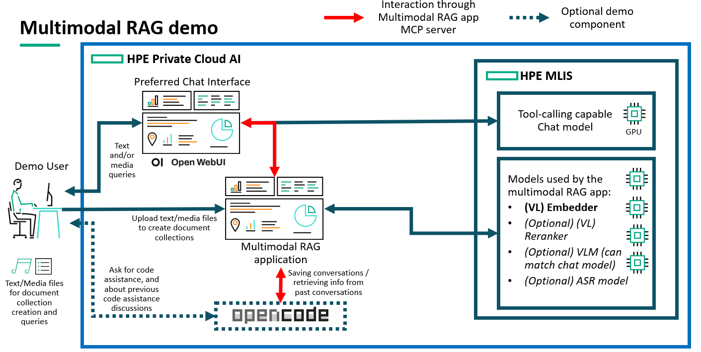

### Functional flow

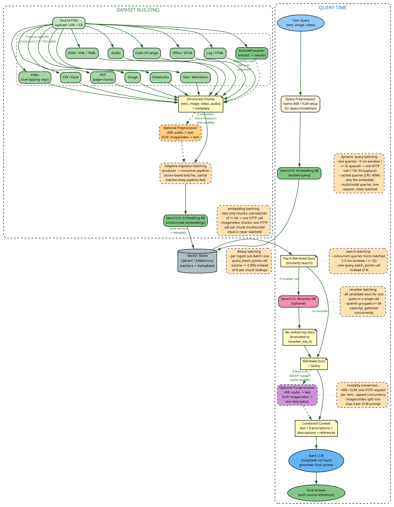

### Workflow

#### Basic Demo Workflow

Once the setup is complete, running the demo would usually consist in:
* Opening the imported RAG application
* Create a new document collection if not done during setup, or if wanting to test RAG with new documents (adding new documents to an existing collection is an option as well)
* Test RAG using the "Search" feature on the application UI, selecting your dataset
* Go to Open WebUI, show connection to the Multimodal RAG MCP server, in the "Integrations" section of admin settings
* (Optional) On Open WebUI, also show the function used for accepting media files as input
* Test RAG on Open WebUI, making sure to enable the RAG MCP server when sending a query to the chat model
* (Optional) On an Opencode instance (either running on your laptop, or on a VSCode server hosted on PCAI), show configuration files to connect to the RAG MCP server. Then, start and finish a conversation. Show on the RAG application UI that the conversation has been saved as a new document. Start another conversation with Opencode, and ask something related to your previous conversation.


## Deployment

### Prerequisites


* **At least 2 GPUs**: one for the chat model to be interacted with once RAG is set up, and one for the embedding model. 
* **(Optional) Up to 3 additional GPUs**:
  * One for the reranker
  * One for the VLM, to provide image descriptions when embedding images/videos. VLM may also be used as the main chat model, assuming it supports tool calls
  * One for the ASR, to transcribe audio files
* **Open WebUI** is recommended, as user-friendly chat interface with possibility for MCP connection. Latest version ported to PCAI is recommended, as native tool calling is enabled by default. Get the latest helm chart from our [frameworks repo](https://github.com/ai-solution-eng/frameworks/tree/main/open-webui).
* **(Optional)** Opencode, either set up on your local machine, or on a VSCode server running on PCAI. See the [demo on how to run Opencode on PCAI](https://github.com/ai-solution-eng/ai-solution-demos/tree/main/basic-code-assistant-opencode) if needed.

**Note**: these prerequisites assume one GPU per model, no more, no less. In practice, while a GPU will be mandatory to deploy a decent chat model, deploying an embedding model on CPU only is an option if compute resources are scarce. Therefore this demo can potentially be played using a single GPU.

### Installation and configuration

**1. Deploy the required models using MLIS**:

 * **All models proposed below with their MLIS configuration are just suggestions**, many alternatives can deployed instead of these specific ones.

* **Mandatory: An embedding model**
  * In particular, while optional, a Vision Language (VL) embedding model is recommended to allow the embedding of images. Using a traditional (non-VL) embedding model will prevent the embedding of images themselves.
  * **Qwen/Qwen3-VL-Embedding-8B** MLIS configuration:
    * Registry: None
    * Model Format: Custom
	* Image: vllm/vllm-openai:latest
	* Resources:
	  * CPU: 8 to 16 (flexible, lower values may work)
	  * Memory: 16Gi to 32Gi (flexible, lower values may work)
	  * GPU: 1 to 1 (mandatory)
	* Arguments: Qwen/Qwen3-VL-Embedding-8B --runner pooling --port 8080 --kv-cache-dtype fp8
    * Note: vLLM deployments all require a GPU by default, including when deploying embedding models. CPU-only embedding options would most likely use a different image. One such image is mentioned in this [Text Embedding Inference](https://github.com/huggingface/text-embeddings-inference) repo.
     
* **Mandatory: A chat model with tool calling capabilities**
  * Any chat model with tool calling capabilities can theoretically be used, but larger models tend to perform these tasks better, resulting in easier information retrieval where it can be challenging for smaller models.
  * To avoid deploying too many different models, we recommend Qwen/Qwen3.8-27B-FP8, as the RAG ingestion flow optionally makes use of a VLM to describe images, leading to better image retrieval, as well as mitigating the lack of embedding model's vision capabilities, should a non-VL embedding model be used.
  * **Qwen/Qwen3.8-27B-FP8** MLIS configuration:
    * Registry: None
    * Model Format: Custom
	* Image: vllm/vllm-openai:latest
	* Resources:
	  * CPU: 8 to 16 (flexible, lower values may work)
	  * Memory: 32Gi to 64Gi (flexible, lower values may work)
	  * GPU: 1 to 1 (mandatory)
	* Arguments: Qwen/Qwen3.8-27B-FP8 --max-model-len 262144 --kv-cache-dtype fp8 --enable-auto-tool-choice --tool-call-parser qwen3_coder --speculative-config {"method":"mtp","num_speculative_tokens":3} --reasoning-parser qwen3 --port 8080
    * Note: This model should fit into a single H200 or RTX 6000 pro, but two GPUs might be needed if using L40S GPUs. In that case, add "-tp 2" as additional parameter and/or reduce "--max-model-len" value.


* **Optional: A Vision Language Model**
  * Used to add image/video descriptions to these files for more efficient retrieval.
  * The Qwen/Qwen3.8-27B-FP8 deployment detailed above can be used to this end.

* **Optional: An Automatic Speech Recognition (ASR) model**
  * This model is used to transcribe audio file into text, effectively enabling computation of embedding on its content, like any text file. This deployment won't be used if not using audio files during your demo.  
  * **CohereLabs/cohere-transcribe-03-2026** MLIS configuration:
    * Registry: None
    * Model Format: Custom
	* Image: ghcr.io/ai-solution-eng/vllm-audio-video:v1.0
	* Resources:
	  * CPU: 4 to 8 (flexible, lower values may work)
	  * Memory: 20Gi to 40Gi (flexible, lower values may work)
	  * GPU: 1 to 1 (mandatory)
	* Arguments: CohereLabs/cohere-transcribe-03-2026 --trust-remote-code --port 8080

* **Optional: A Reranker model**
  * This model is used to refine results coming from the list of documents retrieved through simple similarity search. It is entirely optional, but does benefit, like the embedder, from the ability to process images/videos as input. Hence, the suggestion of deploying a VL-Reranker.
  * This deployment requires "--chat-template" to point to a custom "qwen3_vl_reranker.jinja" template. This template not being available as part of the downloaded model weights folder, nor part of the official vLLM image, it needs to be manually created and made available in the pod that the MLIS deployment will spawn.
  * The simplest way to make this template available to the deployment is to download and save the model weights locally, prior to its deployment, to the default "models-pvc" PVC. This [model downloader tool](https://github.com/ai-solution-eng/tools/tree/main/model-downloader-web) (to be imported as an additional application using its helm chart) can be used to that end, without having to rely on CLI.
  * Using that downloader, download Qwen/Qwen3-VL-Reranker-8B and check the "Write chat template file" box, specifying the following templates/qwen3_vl_reranker.jinja (template being detailed in the [official vLLM documentation](https://docs.vllm.ai/projects/ascend/en/latest/tutorials/models/Qwen3-VL-Reranker.html#51-chat-template)):
```
<|im_start|>system
Judge whether the Document meets the requirements based on the Query and the Instruct provided. Note that the answer can only be "yes" or "no".<|im_end|>
<|im_start|>user
<Instruct>: {{
    messages
    | selectattr("role", "eq", "system")
    | map(attribute="content")
    | first
    | default("Given a search query, retrieve relevant candidates that answer the query.")
}}<Query>:{{
    messages
    | selectattr("role", "eq", "query")
    | map(attribute="content")
    | first
}}
<Document>:{{
    messages
    | selectattr("role", "eq", "document")
    | map(attribute="content")
    | first
}}<|im_end|>
<|im_start|>assistant
```
Once done, you can package and deploy the following model using MLIS:
  * **Qwen/Qwen3-VL-Reranker-8B** MLIS configuration:
    * Registry: None
    * Model Format: Custom
	* Image: vllm/vllm-openai:latest
	* URL: pvc://models-pvc/<YOUR_PATH_TO>/Qwen3-VL-Reranker-8B?containerPath=/mnt/models
	* Resources:
	  * CPU: 8 to 16 (flexible, lower values may work)
	  * Memory: 16Gi to 32Gi (flexible, lower values may work)
	  * GPU: 1 to 1 (mandatory)
	* Arguments: Qwen/Qwen3-VL-Reranker-8B --download-dir /mnt/models/ --runner pooling --port 8080 --hf_overrides {"architectures":["Qwen3VLForSequenceClassification"],"classifier_from_token":["no","yes"],"is_original_qwen3_reranker":true} --chat-template /mnt/models/templates/qwen3_vl_reranker.jinja --kv-cache-dtype fp8


* **Note on downloading and saving model weights prior to model deployment**: Doing so is a very good practice, pausing and resuming the deployment won't trigger a new download, it will just reload the weights in memory, which is fast and energy-efficient compared to pausing and resuming deployments without saved weights.
Downloading and saving the weights, either in the models-pvc, or in a S3 bucket makes the setup a bit longer, but should always be done in production settings.

To use those models, an API token will have to be generated for each of the three deployments. You can do this from the Gen AI -> Model Endpoints page of AIE.


**2. Import the application**:
* Use the helm chart (rag-mcp-server-2.4.0.tar.gz) made available in this folder. Values to provide are:
  * `security.mediaTokenSecret`: Generate one by running `python -c "import secrets; print(secrets.token_hex(32))"`
  * `models.embedder/reranker/vlm/asr.URL`: MLIS endpoint corresponding to the embedder/reranker/vlm/asr deployment (without /v1)
  * `modelSecrets.embedderApiKey/rerankerApiKey/vlmApiKey/asrApiKey`: API token corresponding to the embedder/reranker/vlm/asr deployment


* Note that the application itself does not provide a way to edit these endpoints/API keys. 
If any of them should change, values must be updated by clicking on the "Configure" option on the application tile present on the "Tools & Frameworks" page after its import.

* No other value change should be required to run this demo, but helm charts with alternative sets of values, notably for scaling up the application, can be found in the foundational workflows repo containing the [Multimodal RAG work](https://github.com/ai-solution-eng/foundational-workflows/tree/main/multimodal-rag) this demo is based on.

**3. Create a new document collection**:

* Once the application is imported, access its UI from its tile on the "Tools & Frameworks" page.
* To check whether all models specified in the helm chart values are reachable, you can go to Manage, and click the "Test connections" button:
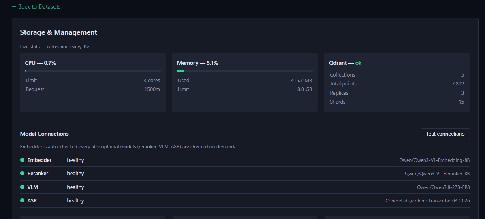
* Make sure that all connections to the models you want the RAG flow to use are in healthy state. Otherwise, go back to the "Tools & Frameworks" page, and update the helm chart values through the "Configure" button.
* Create a new dataset (unless you plan to add new files or reuse an existing one):
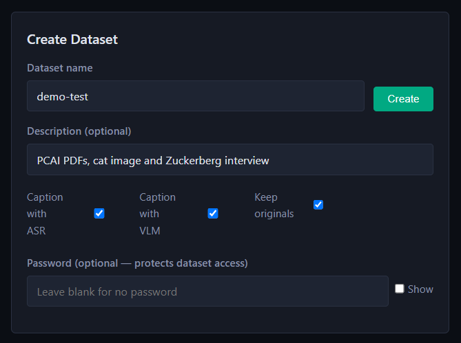
* **Important: While optional, providing an accurate description of your dataset will eventually make it easier for the chat model to understand when to search information from that dataset.** 
The model will indeed need to know which dataset is susceptible to contain information relevant to your query, before effectively searching information using that query. 
* Ideally, you can provide your own files to customize this demo to your audience. For convenience, we provide sample_files.zip, under the [data folder](./data), an archive containing two public PCAI PDFs, a cat image and an extract from an interview with Mark Zuckerberg. These files are not expected to form a relevant dataset, but simply allow quick testing of the RAG, with files from multiple modalities.
* If using the provided sample_files, you can add "Private Cloud AI PDFs, cat image and Zuckerberg interview" as description.
* Select your dataset, one the second panel of the left side of the UI. Make sure it is highlighted:
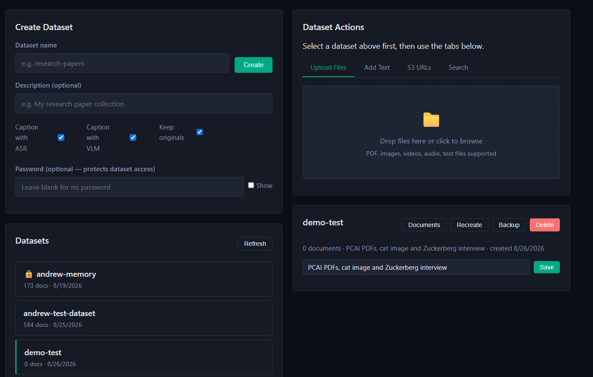
* Upload your files on the right side. Chunking and embedding may take a few minutes. Make sure to wait until this is complete, with the green tick indicating that chunking and embedding are successful:
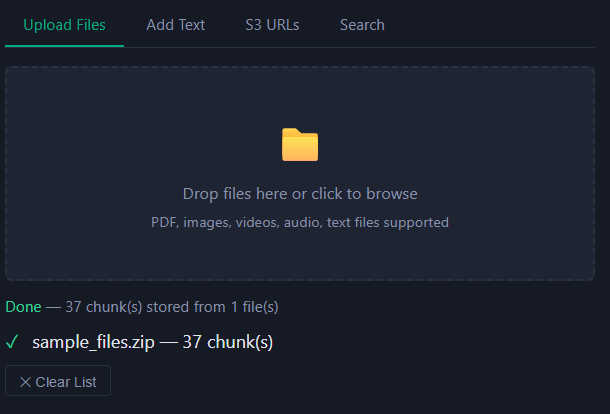
* Once embedding is complete, you can start executing search queries, figuring out good questions to ask your document, and ensuring proper responses to your queries:

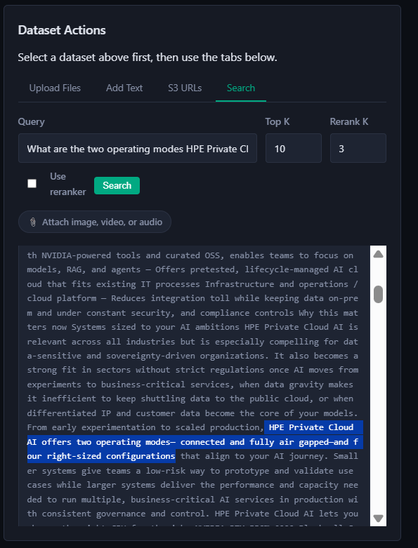
* Note that that you can also make a search using an image, audio or video file, provided a VL embedder and/or a VLM has been deployed and connected to the application:

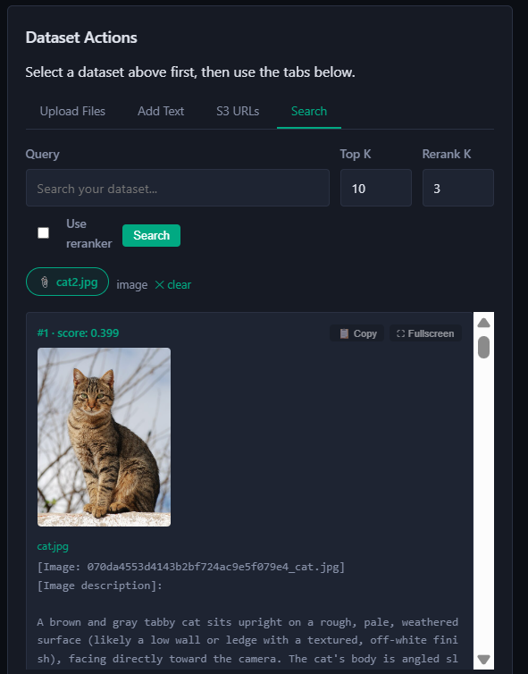


**4. Integrate the Multimodal RAG MCP server to Open WebUI and use it**:
* **Note: from this point onwards, with successful RAG application import and dataset creation, any application able to leverage MCP servers could be configured to use this RAG flow. Open WebUI is an example of such application, chosen from its user-friendly chat interface.** As another example, our [conversational toolbox demo application](https://github.com/ai-solution-eng/ai-solution-demos/tree/main/conversation-toolbox-demo) can be configured to use MCP tools.
* Make sure you have Open WebUI imported to your platform. Import it if not the case. Preferably use the latest helm chart available on our [frameworks repo](https://github.com/ai-solution-eng/frameworks/tree/main/open-webui)
* Connect your chat model to Open WebUI, providing the endpoint and API token in the Admin Settings -> Connections tab
* Go to the Admin Settings -> Integrations -> Click on the + sign to add a new connection, then fill the following:
  * Set Type to MCP Streamable HTTP
  * Set URL to `http://rag-mcp-server-mcp.<DEPLOYMENT_NAMESPACE>.svc.cluster.local:9090/mcp` where <DEPLOYMENT_NAMESPACE> matches the namespace chosen when importing the multimodal RAG application
  * Name, ID and Description don't need specific values:

 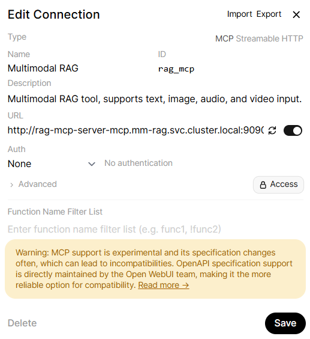
* Chat with the model with access to your documents. Make sure to enable the MCP integration before starting to chat with your model, click on the "Integration" icon at the bottom of the chat box, then Tools, then ticking your MCP server. A wrench icon should appear:
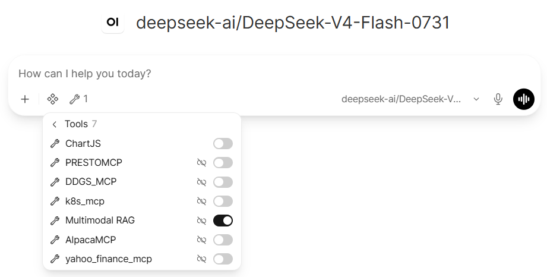
* Example of a simple text-based query:
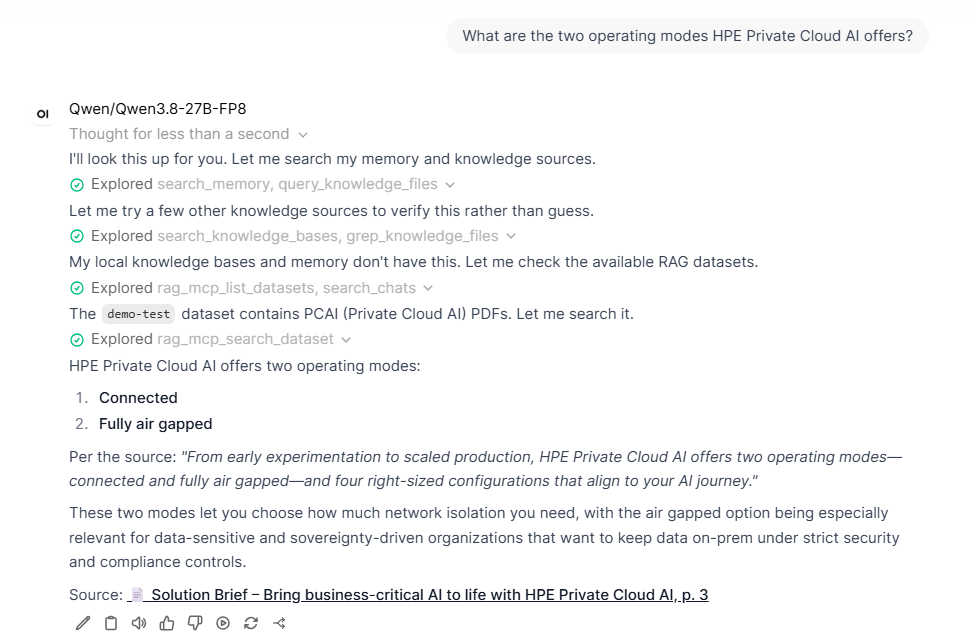
* Note that the model had first to look for which dataset is the most likely to contain the answer to my question, before querying it. It can be helpful to help it a little bit with your queries.
* Example with a question about an audio file:
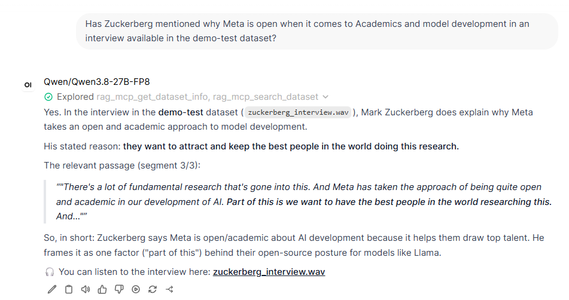
* It is also possible to make queries using media files (like images):
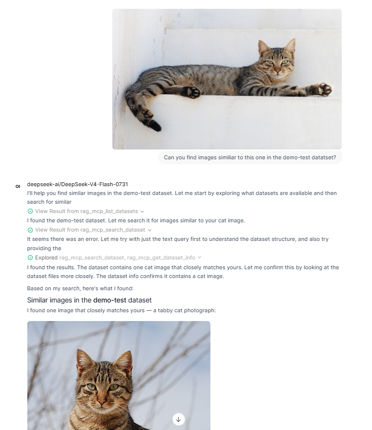
* But these queries will fail by default if not using a VLM (e.g. image queries will work immediately if using Qwen/Qwen3.8-27B-FP8 as chat model). A custom filter function needs to be defined on Open WebUI if we don't want it to throw an error.
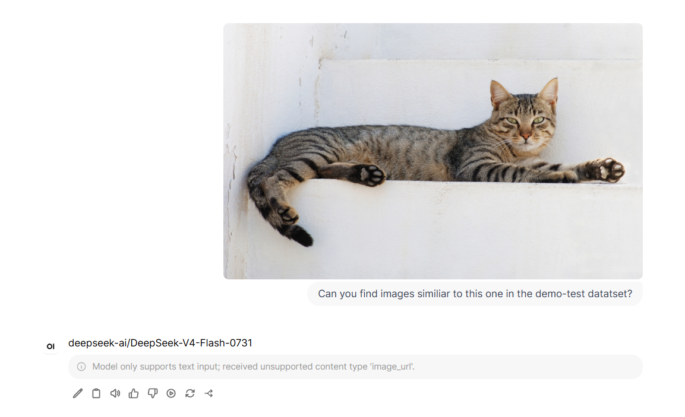

* Optional: Set a filter function to prevent Open WebUI throwing an error when attempting queries that include media files.
  * **This step is only useful if using a non-VLM as chat model, and planning to use images (or other media files) as part of input queries**
  * **Note: this workaround is absolutely unrelated to the RAG flow itself, but is required to bypass an Open WebUI limitation**. Similar workarounds can be expected when working with any other application (e.g. the conversational toolbox demo application only accepts voice or text as input, it can't use all features of the multimodal RAG MCP server either).
  * Go to the Admin panel -> Functions, create a new function. Copy and paste the content of [extensions/openwebui-filter/filter.py](./extensions/openwebui-filter/filter.py) and click save.
  * Make sure it is enabled globally:
 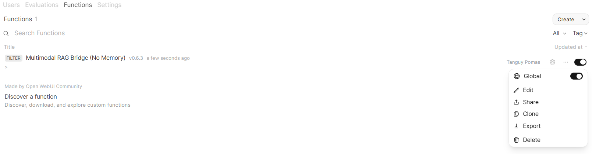

**5. (Optional) Enabling long-term memory of past conversations on Opencode**
* The purpose of this additional step is to have Opencode automatically archive conversations users have with it as a new document collection. It can then use RAG to retrieve information from any past conversation, effectively enabling long-term memory of any code change made using it.
* **Note: This feature has also been made available on Open WebUI, using different filter functions**, but has been ignored so far to keep this demo simple. See details on the [original multimodal RAG repo](https://github.com/ai-solution-eng/foundational-workflows/tree/main/multimodal-rag/openwebui_extension) if you are interested. 
* Create a new dataset from the RAG application UI. It will be used to store all your conversations with opencode as individual documents, make it password-protected:

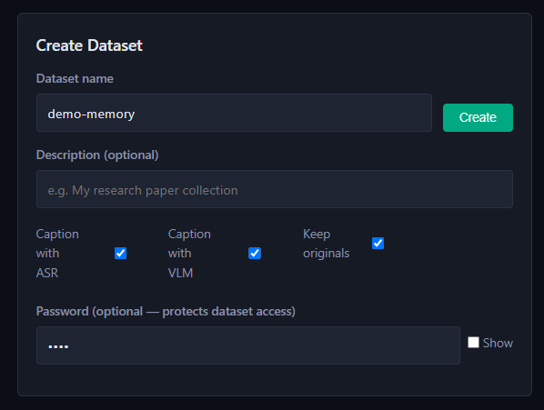
* You may be prompted for its password when trying to open it. Providing it will allow you to list the documents it contains, as well as execute search queries against it, but it should be empty for now:
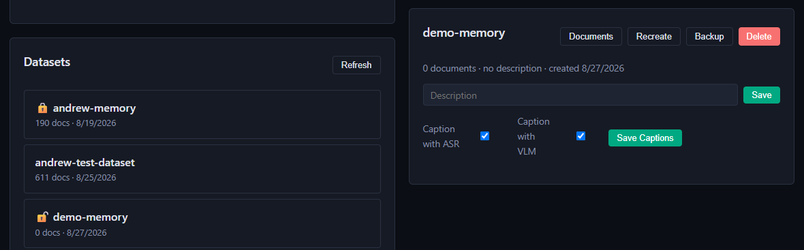
* Either have Opencode ready on you machine, or start a VSCode server on PCAI, installing and setting up Opencode on it, following our [basic Opencode demo](https://github.com/ai-solution-eng/ai-solution-demos/tree/main/basic-code-assistant-opencode).
* Merge your opencode.json file with the provided [opencode.jsonc](extensions/opencode-memory/opencode.jsonc) (or copy and paste the example provided below, changing the following values):
  * Update the `url` section of both `mcp.rag-memory` and `mcp.rag-knowledge` to match your RAG MCP server URL (same value for both).
  * Fill in your chat model URL, API token and name respectively in the sections `provider.myprovider.options.baseURL`, `provider.myprovider.options.APIKey` and `provider.myprovider.models."DEPLOYMENT MODEL ID".name`
  * No other change is required.
  * The resulting file may look like this:
```
{
  "$schema": "https://opencode.ai/config.json",

  // This is a TEMPLATE — copy to your project root (or load via
  // OPENCODE_CONFIG=documentation/opencode.jsonc) before running opencode.
  // AGENTS.md is symlinked at the repo root → documentation/AGENTS.md, so
  // opencode auto-loads it (no "instructions" field needed).

  // ── Multimodal RAG MCP server ───────────────────────────────────────────
  // TWO connections to the SAME server, exposing DIFFERENT tool subsets:
  //   • rag-memory    → personal long-term memory (add_memory / search_memory)
  //   • rag-knowledge → general project/knowledge datasets (search_dataset, …)
  //
  // Per-user isolation comes from the memory dataset PASSWORD (resolved from
  // the X-Dataset-Password header / RAG_MEMORY_PASSWORD env var). The memory
  // dataset name comes from RAG_MEMORY_DATASET. The model itself never sees
  // these — see documentation/AGENTS.md for when the model should recall / write memories.
  //
  // REQUIRED env vars (export before launching opencode):
  //   RAG_MEMORY_DATASET   e.g. "andrew-memory"  (a password-protected dataset
  //                                               you created via the HTML frontend)
  //   RAG_MEMORY_PASSWORD  that dataset's password
  //   RAG_INGRESS_TOKEN    platform bearer token — ONLY if you reach the server
  //                        through the oauth2-proxy ingress (see below)
  //
  // URL: two options —
  //   1) Via the cluster ingress (production): set RAG_INGRESS_TOKEN and use
  //      https://rag-mcp-server.<YOUR-DOMAIN>/mcp  (the Authorization header below).
  //   2) Via `kubectl port-forward deployment/rag-mcp-server 8001:9090` (local
  //      testing): comment out the Authorization header and switch the url to
  //      http://localhost:8001/mcp.
  "mcp": {
    "rag-memory": {
      "type": "remote",
      "url": "http://rag-mcp-server-mcp.<DEPLOYMENT_NAMESPACE>.svc.cluster.local:9090/mcp",
      "headers": {
        // Keep while going through the oauth2-proxy ingress; drop for port-forward.
        "Authorization": "Bearer {env:RAG_INGRESS_TOKEN}",
        // These two are read ONLY by add_memory / search_memory server-side,
        // so a memory password can never silently unlock another dataset.
        "X-Memory-Dataset": "{env:RAG_MEMORY_DATASET}",
        "X-Dataset-Password": "{env:RAG_MEMORY_PASSWORD}"
      }
    },
    "rag-knowledge": {
      "type": "remote",
      "url": "http://rag-mcp-server-mcp.<DEPLOYMENT_NAMESPACE>.svc.cluster.local:9090/mcp",
      "headers": {
        "Authorization": "Bearer {env:RAG_INGRESS_TOKEN}"
      }
    }
  },

  // Scope each connection to its intended tool subset. opencode prefixes MCP
  // tools with the server name + "_" (verify the exact names with
  // `opencode mcp list` after connecting, then adjust these patterns if needed).
  "tools": {
    "rag-memory_search_dataset": false,
    "rag-memory_list_datasets": false,
    "rag-memory_get_dataset_files": false,
    "rag-memory_get_dataset_info": false,
    "rag-memory_unlock_dataset": false,
    "rag-memory_describe_media": false,
    "rag-memory_transcribe_audio": false,

    "rag-knowledge_add_memory": false,
    "rag-knowledge_search_memory": false
  },

  "provider": {
    "myprovider": {
      "npm": "@ai-sdk/openai-compatible",
      "name": "MLIS",
      "options": {
        "baseURL": "DEPLOYMENT URL/v1",
        "apiKey" : "DEPLOYMENT TOKEN"
      },
      "models": {
        "DEPLOYMENT MODEL ID": {
          "name": "MODEL NAME"
        }
      }
    }
  },
  "permission": {
  "*": "ask",
  "bash": {
    "*": "ask",
    "ls *": "allow",
    "grep *": "allow",
    "glob *": "allow",
    "rm *": "deny",
  },
  "edit": "ask",
  "read": "allow",
  "glob": "allow",
  "question": "allow",
  "webfetch": "ask",
  "websearch": "ask",
  "codesearch": "ask",
  "external_directory": "deny",
  "doom_loop": "deny"
  }
}
```
* Details regarding these different components and their purpose is provided in the [original multimodal RAG work](https://github.com/ai-solution-eng/foundational-workflows/blob/main/multimodal-rag/documentation/MEMORY.md) found in the foundational workflow repo.
* Drag and drop the AGENTS.md file, as well as the plugins and tools folders, made available in this repo under [extensions/opencode-memory](./extensions/opencode-memory), in your ~/.config/opencode folder. You should have the following config files:
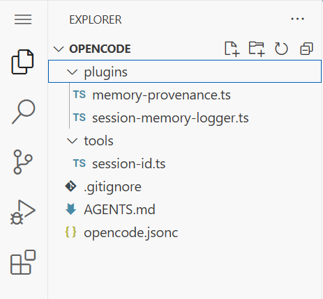
* Next, set RAG_MEMORY_DATASET and RAG_MEMORY_PASSWORD environment variables values to match the memory dataset and password you created on the RAG application UI:
```
export RAG_MEMORY_DATASET=<YOUR_DATASET>
export RAG_MEMORY_PASSWORD=<ITS_PASSWORD>
```
* If the setup is complete, `opencode mcp list` should return two MCP servers connected:
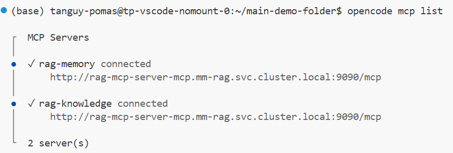
* At this stage, everytime you finish a conversation with Opencode, it will be saved as an additional document on your dataset. Example with a very basic conversation:
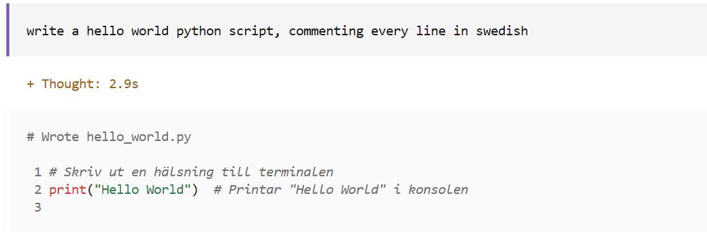
* Making a seemingly untracked change (outside of conversation history):
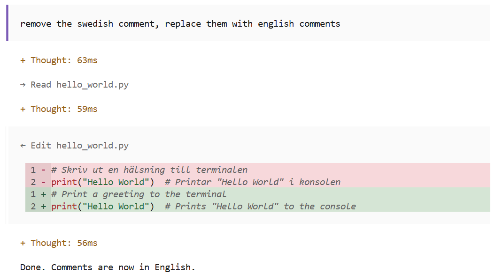
* Exit Opencode and go back to the RAG application UI, you'll notice your dataset has a document. You can execute any search query to retrieve your Opencode conversation:
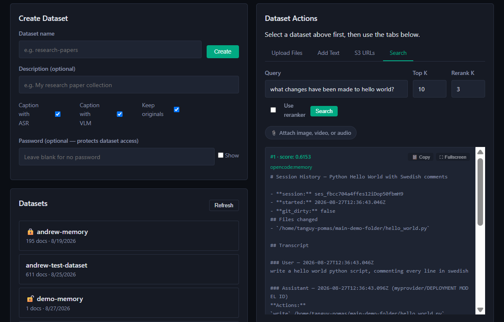
* Start a new Opencode session, you can ask about tasks that have been executed during the previous conversation, it should be able to retrieve the information from the memory dataset: 
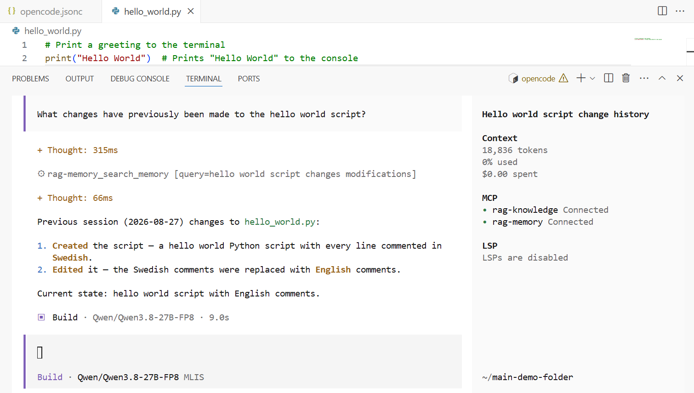


## Important notes

* This demo and its documentation do not cover all the technical details, nor use all features of the imported multimodal RAG application. Users willing to learn more about how this application work can check the [original multimodal RAG work](https://github.com/ai-solution-eng/foundational-workflows/tree/main/multimodal-rag/documentation) in the foundational workflow repo.
* Open WebUI and Opencode are just examples of applications that can make use of this multimodal RAG flow: any application that allows users to bring an MCP server to provide tools for LLMs could theoretically leverage this work. In practice, limitations may apply, requiring custom workarounds (e.g. Open WebUI rejecting images as input if the chat model does not accept them).
* Simple chat models without tool calling capabilities are usually enough for RAG. This RAG flow, however, relies on making tool calls before getting information from chunks relevants to the user's queries. Not only it has to have tool-calling capabilities, but it also needs reasoning capabilities to figure out which tool to call and when.
* Details on the actual list of tools the MCP server provides can be found in the [original multimodal RAG work](https://github.com/ai-solution-eng/foundational-workflows/blob/main/multimodal-rag/documentation/MCP.md#2-available-tools-9) from the foundational workflow repo.
