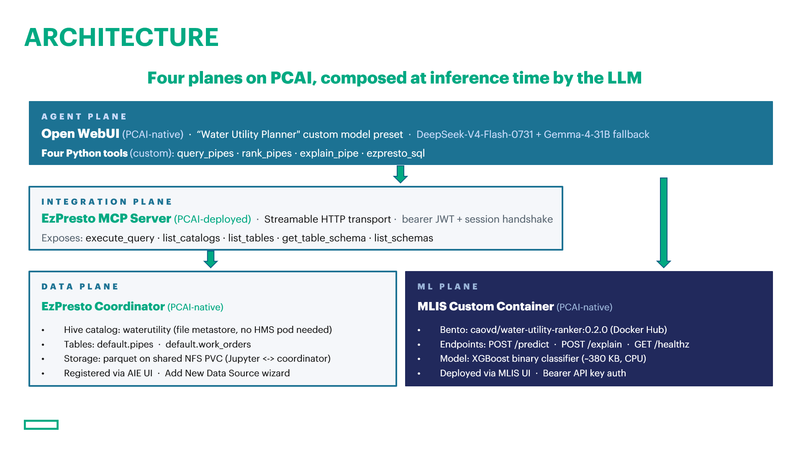
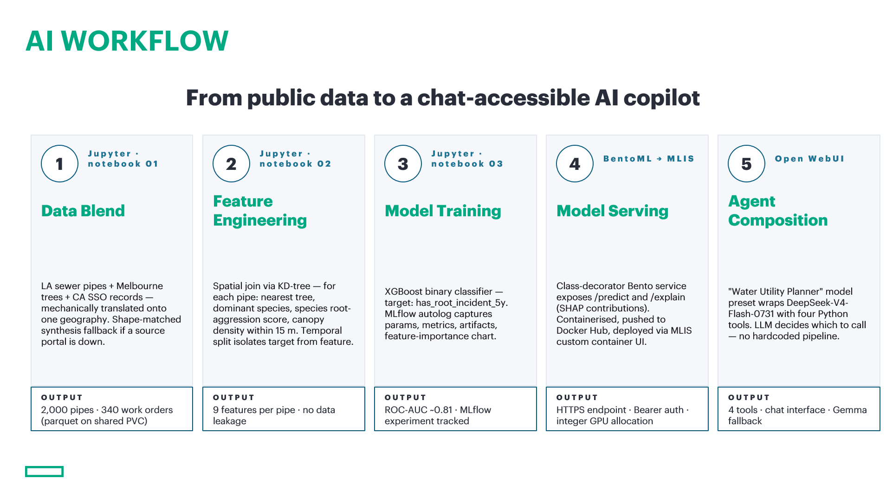

# Agentic Water Utility Planner - Tree Root Infiltration Risk Ranker

| Owner                 | Name       | Email                                     |
| --------------------- | ---------- | ----------------------------------------- |
| Use Case Owner        | Daniel Cao | <daniel.cao@hpe.com>                      |
| PCAI Deployment Owner | Daniel Cao | <daniel.cao@hpe.com>                      |

## Abstract

Sewer pipe blockages from tree root infiltration are a leading cause of sanitary sewer overflow (SSO) events for water utilities. Most utilities inspect on a calendar (every pipe every N years), which wastes budget on healthy pipes and misses at-risk ones. This demo shifts the model from calendar-based to risk-based prioritisation by combining an XGBoost predictive model with the utility's own operational data, delivered as an agentic chat copilot.

An asset planner types a question — *"Which pipes should I CCTV inspect in the north district next quarter, budget for 50?"* — and the LLM chooses which tools to call, fetches pipe features from **EzPresto**, scores them via a **BentoML-packaged XGBoost model on MLIS**, joins the ranked results with the work-order register via federated SQL, and returns a table with plain-English risk explanations. All self-hosted on PCAI.

- Ranks 2,000 sewer pipes by predicted 5-year tree-root incident probability
- Explains any pipe's score in plain English via SHAP-style feature contributions
- Federates model output with operational work-order data at query time
- Delivers everything through a chat interface — no dashboards, no forms

Features:

- Four LLM-callable tools composed at inference time (no hardcoded pipeline)
- **`query_pipes`** — browse pipes by district
- **`rank_pipes`** — SQL fetch → MLIS scoring → sorted top-K
- **`explain_pipe`** — SQL fetch → MLIS SHAP contributions → plain English
- **`ezpresto_sql`** — ad-hoc read-only SQL for cross-catalog JOINs and aggregations
- Model preset in Open WebUI carries system prompt + tool selection (one-click for the end user)
- Hot-swappable base LLM (DeepSeek-V4-Flash-0731 primary, Gemma-4-31B-AB fallback)
- Streamable-HTTP MCP client with session handshake and automatic re-init on session expiry

Recordings:

- [Part 1 - Intro & Live agent chat walkthrough [~7 min]](https://storage.googleapis.com/ai-solution-engineering-videos/public/Water%20Utility%20Agentic%20Planner%20-%20Short%20version.mp4)
- *[Part 2 - Workflow technical deep dive ]* — TBD

## Description

### Overview

The demo is built as four planes, composed at inference time by the LLM. PCAI-native components (Open WebUI, EzPresto, MLIS, MCP server) are used out of the box. The Bento service, OWU tool file, Hive catalog registration, and OWU model preset are what we authored.



### Workflow

Five stages, executed in order. Each stage produces a durable artefact (a file, a container image, an endpoint) that the next consumes — nothing is stitched together at runtime.



The nine model features are:

| Feature | Type | Notes |
|---|---|---|
| `age_years` | float | Current year − `year_installed` |
| `material_ordinal` | int (0-4) | HDPE=0, PVC=1, CONC=2, CI=3, VC=4 |
| `diameter_mm` | float | Pipe inner diameter |
| `slope_pct` | float | Longitudinal slope |
| `depth_m` | float | Depth below surface (semi-synthetic engineering estimate) |
| `nearest_tree_dist_m` | float | Metres to nearest tree (KD-tree spatial join) |
| `trees_within_15m` | int | Count within 15 m radius |
| `dominant_species_riskscore` | float (0-1) | Species root-aggression score (curated lookup) |
| `historical_incident_count` | int | Past-5y incident count |

Target: `has_root_incident_5y` (binary, next-5y label).

## Deployment

### Prerequisites

Cluster capabilities (must exist on your PCAI cluster):

- **AIE 1.10.1** with:
  - MLflow tracking server pre-deployed cluster-wide, `MLFLOW_TRACKING_URI` env var injected into notebook pods
  - MLIS available in the UI, supporting custom-container model deployment
  - EzPresto coordinator running with the "Add New Data Source" wizard available
  - EzPresto MCP server pre-deployed (this demo assumes `http://mcp-ezpresto-server.mcp-ezpresto-server.svc.cluster.local:9097/mcp`)
  - Open WebUI (verified on v0.8.12)
  - At least one LLM served via MLIS (this demo uses `deepseek-v4-flash-0731` primary, `gemma-4-31b-ab` fallback)
- **Shared PVC** mounted by both Jupyter and EzPresto coordinator (different mount points on each pod are fine — verify with `kubectl exec <coordinator-pod> -- mount | grep -iE "shared"`)
- **1 CPU worker** with capacity for a ~500m CPU / 1 GiB RAM container — **no GPU required** for the ranker itself
- **Docker Hub account** (or private registry MLIS can pull from)

Access needed:

- Kubernetes `get`/`list` on pods, secrets, services (multiple namespaces)
- Kubernetes `exec` into the EzPresto coordinator (to verify PVC mount paths and directory write permissions)
- Bearer JWT for MCP — obtainable from the `kagent/ezpresto-agent` Secret if that pattern exists on your cluster
- MLIS admin access to deploy custom container endpoints

Not required:

- GPU (XGBoost CPU is fast enough)
- Kubernetes cluster admin (all steps are self-service through AIE UI + Jupyter + `kubectl exec`)
- Shell access to the EzPresto coordinator config directory (we use `file` metastore, no HMS pod)

### Installation and configuration

**Repository layout:**

```
water-utility-ranker/
├── README.md                                 this file
├── notebooks/
│   ├── 00_data_blend.ipynb                   data pipeline
│   ├── 01_train_with_mlflow.ipynb            XGBoost + MLflow
│   └── 02_bento_package.ipynb                BentoML build + containerize
├── owu-tools/
│   └── water_utility_ranker.py               four LLM tools (v0.4.1)
└── ezpresto/
    └── DDL.sql                                CREATE TABLE statements
```

Bento service source (`service.py`, `bentofile.yaml`, `requirements.txt`) is written inline in notebook 02 — the notebook is self-contained; no separate `bento/` directory needed at runtime.

**Step 1 — Run the three notebooks in order**

- `notebooks/00_data_blend.ipynb` → produces `pipes_blended.parquet` (~2,000 rows, 19 cols) and `work_orders.parquet` (~340 rows) in the `shared/` mount. Blends three real public sources (LA City Sewer Pipes, Melbourne Urban Forest, California SSO Reduction Program) with shape-matched synthetic fallbacks per source.
- `notebooks/01_train_with_mlflow.ipynb` → trains XGBoost binary classifier, logs via `mlflow.xgboost.autolog()`, writes `shared/ranker_v1.json`. Typical holdout ROC-AUC ~0.81 on synthesised labels (see [Limitations](#limitations)).
- `notebooks/02_bento_package.ipynb` → registers the model in the BentoML store, writes the service source files inline, runs `bentoml build`, runs `bentoml containerize` (skip if the Jupyter kernel doesn't have Docker; fall back to a workstation with Docker).

**Step 2 — Push the container image and deploy on MLIS**

```bash
docker login -u <docker-hub-user>
docker push <docker-hub-user>/water-utility-ranker:0.2.0
```

In AIE UI → **MLIS → Deploy Model → Custom Container**:

| Field | Value |
|---|---|
| Model name | `water-utility-ranker` |
| Image URI | `docker.io/<docker-hub-user>/water-utility-ranker:0.2.0` |
| Container port | `3000` (BentoML default) |
| Health check path | `/healthz` |
| Replicas | `1` |
| GPU | `0` |
| CPU / RAM | 500m / 1Gi request; 2000m / 2Gi limit |

MLIS returns an endpoint URL (`<MLIS_URL>`) and API key (`<MLIS_KEY>`). Verify:

```python
import requests
r = requests.post(f"{MLIS_URL}/predict",
    headers={"Authorization": f"Bearer {MLIS_KEY}"},
    json={"instances": [{
        "age_years": 83.0, "material_ordinal": 4, "diameter_mm": 300.0,
        "slope_pct": 1.2, "depth_m": 2.1, "nearest_tree_dist_m": 923.75,
        "trees_within_15m": 0, "dominant_species_riskscore": 0.9,
        "historical_incident_count": 1
    }]})
print(r.status_code, r.json())  # Expect: 200 {"predictions": [0.xx]}
```

**Note**: `/explain` requires the single-row body wrapped under `"row"`:
```python
json={"row": {"age_years": 83.0, ...}}   # BentoML v1.4 wraps single-object args under the parameter name
```

**Step 3 — Register the EzPresto Hive catalog**

Prepare the shared PVC layout from a Jupyter cell (adjust `base` to your Jupyter mount):

```python
import os, shutil
base = "/mnt/shared/dcao/water-utility"

for sub in ["hive-metastore", "pipes", "work_orders"]:
    d = f"{base}/{sub}"
    os.makedirs(d, exist_ok=True)
    os.chmod(d, 0o777)   # coordinator likely runs as a different UID

# Move parquet files into per-table subdirectories (Hive external tables want one dir per table)
for src, dst in [
    (f"{base}/pipes_blended.parquet", f"{base}/pipes/pipes_blended.parquet"),
    (f"{base}/work_orders.parquet",   f"{base}/work_orders/work_orders.parquet"),
]:
    if os.path.exists(src):
        shutil.move(src, dst)
```

Verify the coordinator sees the same volume (path may differ — this demo cluster had Jupyter at `/mnt/shared/...` and coordinator at `/data/shared/...`):

```bash
kubectl -n ezpresto exec ezpresto-sts-mst-0 -- mount | grep -iE "shared"
kubectl -n ezpresto exec ezpresto-sts-mst-0 -- ls -la /data/shared/dcao/water-utility/
kubectl -n ezpresto exec ezpresto-sts-mst-0 -- \
  sh -c 'touch /data/shared/dcao/water-utility/hive-metastore/write-test && rm /data/shared/dcao/water-utility/hive-metastore/write-test && echo OK'
```

In AIE UI → **Data Sources → + Add New Data Source → Hive**:

| Field | Value |
|---|---|
| Name | `waterutility` (no hyphens — Presto SQL disallows them in catalog names) |
| Hive Metastore | `file` |
| Hive Metastore Catalog Dir | `file:/data/shared/dcao/water-utility/hive-metastore` (coordinator's path, single-slash `file:` prefix) |
| Hive Metastore User | `presto` |
| Enable Local Snapshot Table | ✓ |

Then run the DDL in `ezpresto/DDL.sql` via AIE Query Editor to create `waterutility.default.pipes` and `waterutility.default.work_orders` as external tables over the parquet subdirectories.

Sanity checks:

```sql
SELECT COUNT(*) FROM waterutility.default.pipes;         -- Expected: 2000
SELECT COUNT(*) FROM waterutility.default.work_orders;   -- Expected: ~340

-- The federation query the LLM will replicate for the customer:
SELECT COUNT(*) AS never_inspected
FROM waterutility.default.pipes p
LEFT JOIN waterutility.default.work_orders w ON p.pipe_id = w.pipe_id
WHERE w.work_order_id IS NULL;                            -- Expected: ~1660
```

Do NOT use `USING (pipe_id)` on that LEFT JOIN — Presto merges the join key and the subsequent `WHERE w.pipe_id IS NULL` fails to resolve. Use explicit `ON` and filter on a non-key right-side column (`w.work_order_id`).

**Step 4 — Grab a fresh MCP bearer token**

The EzPresto MCP server on this cluster requires a bearer JWT + a Streamable-HTTP session handshake. The JWT is available in the `kagent/ezpresto-agent` Secret:

```bash
kubectl -n kagent get secret ezpresto-agent -o jsonpath='{.data.config\.json}' \
  | base64 -d \
  | python3 -c "import sys, json; c=json.load(sys.stdin); \
      print(c['http_tools'][0]['params']['headers']['Authorization'].replace('Bearer ',''), end='')"
```

The `end=''` suppresses a trailing newline that would otherwise invalidate the JWT signature. Token is a Kubernetes-projected service account token and expires ~1 hour after the ezpresto-agent last rotated it. Refresh before demos. If the Secret's token looks stale, force a rotation:

```bash
kubectl -n kagent rollout restart deploy/ezpresto-agent
```

Verify the token works end-to-end via [MCP Inspector](https://github.com/modelcontextprotocol/inspector):

- Transport: Streamable HTTP
- URL: `http://mcp-ezpresto-server.mcp-ezpresto-server.svc.cluster.local:9097/mcp` (port-forward first if testing from outside the cluster)
- Custom Header: `Authorization: Bearer <token>` (enable the toggle)
- Click **Connect**, then Tools → `list_catalogs` → **Run Tool** — expect a JSON array including `"waterutility"`

**Step 5 — Configure Open WebUI**

Upload the tool file: OWU → **Admin Panel → Workspace → Tools → + Create Tool**, paste `owu-tools/water_utility_ranker.py`.

Configure valves (⚙ on the tool):

| Valve | Value |
|---|---|
| `EZPRESTO_MCP_URL` | `http://mcp-ezpresto-server.mcp-ezpresto-server.svc.cluster.local:9097/mcp` (default) |
| `EZPRESTO_MCP_TOKEN` | JWT from Step 4 (no `Bearer ` prefix — the tool prepends it) |
| `EZPRESTO_SQL_TOOL` | `execute_query` (confirm via MCP Inspector Tools tab) |
| `MLIS_ENDPOINT_URL` | `<MLIS_URL>` from Step 2, no trailing slash |
| `MLIS_API_KEY` | `<MLIS_KEY>` from Step 2 |
| `TIMEOUT_SECONDS` | 20 |
| `VERIFY_TLS` | true |

Create the model preset: OWU → **Admin Panel → Workspace → Models → + New Model**

- **Name**: `Water Utility Planner`
- **Base Model**: `deepseek-v4-flash-0731`
- **System Prompt**:
  ```
  You are an asset-planning copilot for a state-level water utility. You help
  planners prioritise sewer pipe inspections and understand tree root
  infiltration risk.

  You have four tools:
  - rank_pipes: for prioritised inspection lists in a district ("top N to inspect")
  - explain_pipe: for per-pipe justifications ("why is this pipe risky")
  - query_pipes: for browsing pipes in a district (no ranking)
  - ezpresto_sql: ONLY for questions the above cannot answer — cross-catalog
    JOINs, aggregations, GROUP BY. Prefer the specialised tools first.

  Guidance:
  - When rank_pipes returns results, present them as a short table with
    pipe_id, risk_score, material, age, and nearest tree distance.
  - When explain_pipe returns contributions, name the top 2-3 features in
    plain English with their actual values (e.g. "tree only 4m away" not
    "nearest_tree_dist_m: 4.0").
  - Do not fabricate pipe IDs, districts, or features. If a question requires
    a filter that isn't in the data (e.g. "near schools"), say so plainly.
  - Ground every specific number in a tool call — never guess a risk score.
  ```
- **Tools**: check `Water Utility Ranker` only
- **Capabilities**: uncheck Web Search, Image Generation, Code Interpreter (they tempt the LLM away from the domain tools)
- **Advanced Params → Function Calling**: `Native`
- **Save**

## Running the demo

Two demos are provided, tuned for different audiences. Both work from the same underlying deployment.

### Demo 1 — End-to-end user story (Open WebUI chat)

The customer-facing story: a planner opens a chat and does a full inspection-planning workflow in five prompts.

Fresh chat → model selector → **Water Utility Planner**. Send these prompts in order:

**Beat 1 — the ranker fires**

> Which pipes in the northern district should I CCTV inspect next quarter? Budget for 50 inspections.

Expected trace: `rank_pipes(district="NORTH", top_k=50, budget=50)` — one tool call, table of 50 pipes with real pipe IDs sorted by predicted risk score.

**Beat 2 — per-pipe justification**

> Explain why the top one is risky.

Expected trace: `explain_pipe(pipe_id="<top-id-from-beat-1>")` — SHAP-style top contributions rendered in plain English (e.g. *"4 recorded historical incidents, 123 years old, vitrified clay material"*).

**Beat 3 — feature-importance narrative**

> Which factors is your model relying on most for its risk scores? Are those the drivers I'd expect for tree root infiltration?

Expected: the LLM investigates by chaining several `ezpresto_sql` and `explain_pipe` calls to characterise the model's behaviour across the district, then answers with nuance — historical incidents dominate, tree proximity matters only at very close range, age and material carry the rest.

**Beat 4 — the federation moment **

> Of the 50 pipes you just ranked, how many have never had a work order logged?

Expected trace: `ezpresto_sql` fires with a LEFT JOIN across `pipes` and `work_orders`. On the demo dataset ~35 of the 50 (70%) come back as never-inspected — the ranked list is a "first-look / baseline inspection" for most of them.

**Beat 5 — graceful degradation**

> Filter the results to only pipes within 200 metres of a school.

Expected: the LLM declines cleanly — no school-location data in the schema. It offers a data-grounded alternative (proximity to trees) instead of fabricating a filter.

**Optional Beat 6 — model swap**: change the model picker to `gemma-4-31b-ab`, rerun Beat 1. Same tool chain, functionally equivalent output — evidence the scaffolding is model-agnostic.

### Demo 2 — SQL developer story (AIE Query Editor)

The technical-audience story: prove the federation happens in EzPresto, not in Python. Run these in AIE UI → **Query Editor**:

**1. Row counts**

```sql
SELECT COUNT(*) FROM waterutility.default.pipes;         -- 2000
SELECT COUNT(*) FROM waterutility.default.work_orders;   -- ~340
```

**2. Material distribution — the training signal is real**

```sql
SELECT material, COUNT(*) AS cnt,
       ROUND(AVG(age_years), 1) AS avg_age,
       SUM(has_root_incident_5y) AS confirmed_incidents
FROM waterutility.default.pipes
GROUP BY material
ORDER BY cnt DESC;
```

Vitrified clay (VC) dominates the register and accounts for most incidents — matches published research on root-invasive failure modes.

**3. The federation query **

```sql
SELECT COUNT(*) AS never_inspected
FROM waterutility.default.pipes p
LEFT JOIN waterutility.default.work_orders w
  ON p.pipe_id = w.pipe_id
WHERE w.work_order_id IS NULL;
-- Expected: ~1660
```

This is the exact query the LLM writes in Beat 4 of Demo 1. Same result, ~1.6 seconds against real Presto.

**4. Age-vs-incidents correlation — the model isn't magic**

```sql
SELECT
  CASE
    WHEN age_years < 30  THEN '0-30 years'
    WHEN age_years < 60  THEN '30-60 years'
    WHEN age_years < 90  THEN '60-90 years'
    ELSE '90+ years'
  END AS age_band,
  COUNT(*) AS pipes,
  ROUND(AVG(has_root_incident_5y) * 100, 1) AS incident_rate_pct
FROM waterutility.default.pipes
GROUP BY 1
ORDER BY 1;
```

Older pipes have measurably higher incident rates — the ML model learns this monotonic relationship along with the harder-to-see interactions between age, tree proximity, and material.

## Limitations

1. **Synthesised labels.** The three source datasets (LA sewer pipes, Melbourne urban forest, California SSO records) are real; the mechanical spatial reconciliation and the target label are engineered. The framing throughout is *"inspired by three real public sources, mechanically translated and spatially reconciled — not fully synthetic, not originally intact, engineered to be representative."* The **shape** of feature importance (age, tree proximity, species aggression dominating) is defensible; the **absolute** ROC-AUC of ~0.81 is not — a real customer's data would typically land at 0.65–0.75 initially, climbing as CCTV outcomes accumulate. **Lead with feature importance in customer conversations, not AUC.**

2. **Bearer token expiry.** The `EZPRESTO_MCP_TOKEN` valve holds a Kubernetes-projected service-account JWT that expires roughly every hour. For demos this is fine — refresh once before the meeting. For production, tokens would need to be fetched dynamically from a pod with the right service-account identity (out of scope for this POC).

3. **MCP session lifetime.** After ~30 min of chat inactivity the MCP server may garbage-collect the session. The tool's `_mcp_call` handles this by re-initialising once and retrying, so the user just sees a ~1s delay on the first call after a break.

4. **Three columns are fully synthesised.** `soil_class`, `traffic_load_class`, and part of `depth_m` do not come from the source datasets — LA's public register does not publish them. In a real customer engagement these would come from their soil-survey layer, traffic-count data, and CCTV depth measurements (all federatable via EzPresto).

5. **Single MLIS replica, no HA.** Fine for demos. Production would need standard horizontal-scaling patterns.

6. **No live retraining loop.** Notebook 01 is manually re-runnable. Production would schedule it via Kubeflow / Argo Workflows against MLflow's model registry.

7. **OWU 0.10+ native MCP integration deliberately not used.** OWU 0.10 added an "Add MCP Tool Server" UI; this demo runs on OWU 0.8.12 (and any 0.5.0+), so the MCP client logic is bundled into the Python tool file. All four tools (including the `ezpresto_sql` passthrough) live in one uploaded file. On OWU 0.10+ the same file still works — the tool file's MCP client and OWU's native MCP integration are independent.

8. **Written for one specific cluster's EzPresto MCP.** The MCP server's SQL tool name (`execute_query`), path (`/mcp`), and Streamable HTTP transport are what was observed on the reference cluster. Other clusters may expose a different tool name or transport — verify with MCP Inspector before configuring the valve.
